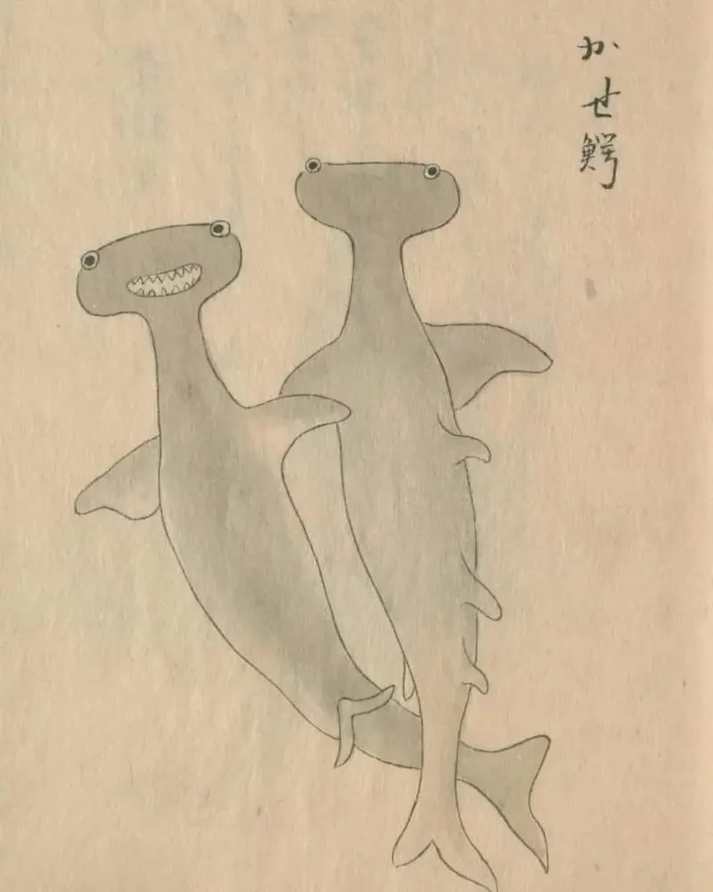

- Dr. Alex Wissner-Gross on [the first multi-behavior brain upload](https://theinnermostloop.substack.com/p/the-first-multi-behavior-brain-upload), of a fruit fly #animals #brain #neuroscience #[[brain uploads]] #[[fruit fly]]
- Stack Overflow on the golden era of Stack Overflow - [Tell me about the good old days, papa](https://meta.stackoverflow.com/questions/438301/tell-me-about-the-good-old-days-papa) #[[Stack Overflow]] #[[history of technology]] #web #[[social media]]
- [via bsky](https://bsky.app/profile/chowleen.bsky.social/post/3mb2vhw2xcs27), enjoy joyous Edo-period hammerhead sharks #art #Japan #sharks #[[Edo period]]
	- {:height 525, :width 411}