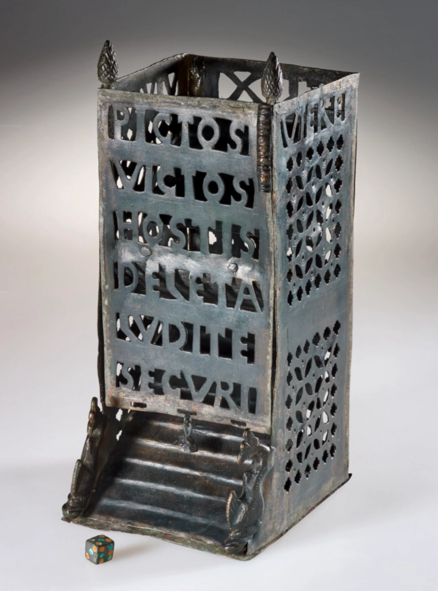

- Matt Parsons on [teaching Claude to be lazy](https://www.parsonsmatt.org/2026/03/10/teaching_claude_to_be_lazy.html) #Claude #[[AI coding assistants]] #AI #ergonomics #devtools
- [via Alison Fisk on bsky](https://bsky.app/profile/alisonfisk.bsky.social/post/3mgcwcenprs2y), ancient Roman dice tower! it's not just a predilection of D&D players! #history #gaming #Rome #dice
	- {:height 538, :width 402}
- Daniel Davies on the Iraq war and [the d-squared one-minute MBA](https://blog.danieldavies.com/2004/05/d-squared-digest-one-minute-mba.html): **Good ideas do not need lots of lies told about them in order to gain public acceptance** #war #management