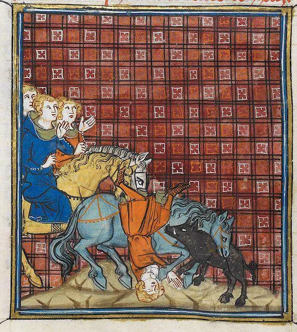

- Iris Meredith [on Tolkien and flavors of hope](https://deadsimpletech.com/blog/amdir_estel_peter_thiel) #hope #books #Tolkien
- Jingyi Wu on [grief, and her grandmother's life in a changing China](https://www.jingyiwu.org/life-writing/relief-and-grief-is-a-strange-mix-of-emotions) #biography #China #history #dementia #grief
- from the *Grands chroniques de France*, Philip of France's untimely death by tripping over a pig #France #illumination #art #medieval
	- {:height 498, :width 439}