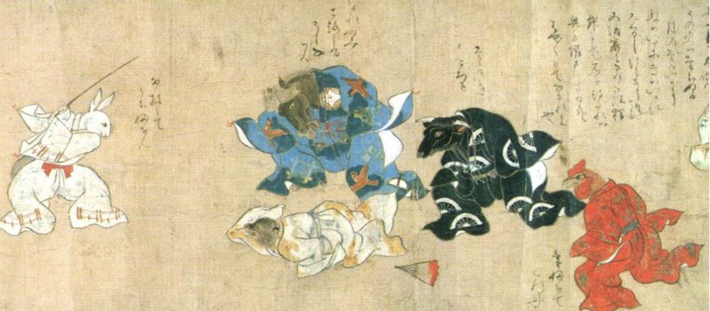

- via Nature, [is indefinite cloning posslbe? mouse experiments point to "no"!](https://www.nature.com/articles/d41586-026-00945-7) #biology #mice #cloning
- from the [Junirui kassen emaki](https://harvardartmuseums.org/collections/object/211644) #Japan #art #weirdmedievalguys #animals
	- 