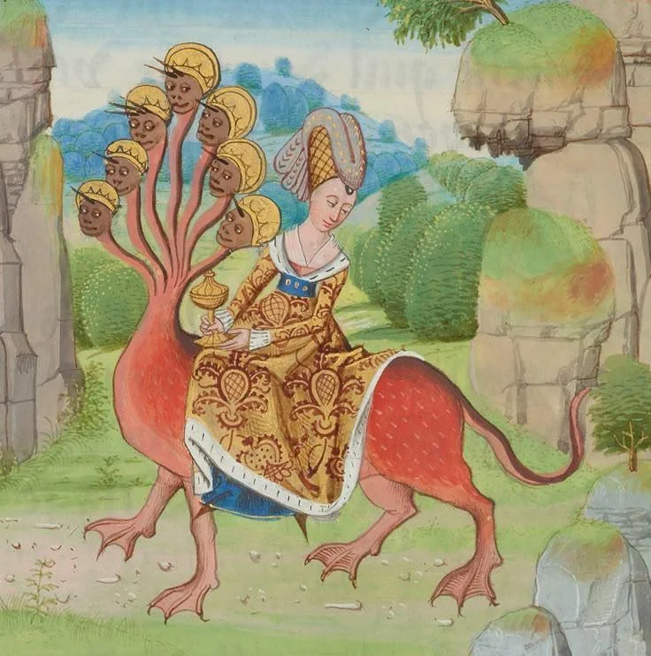
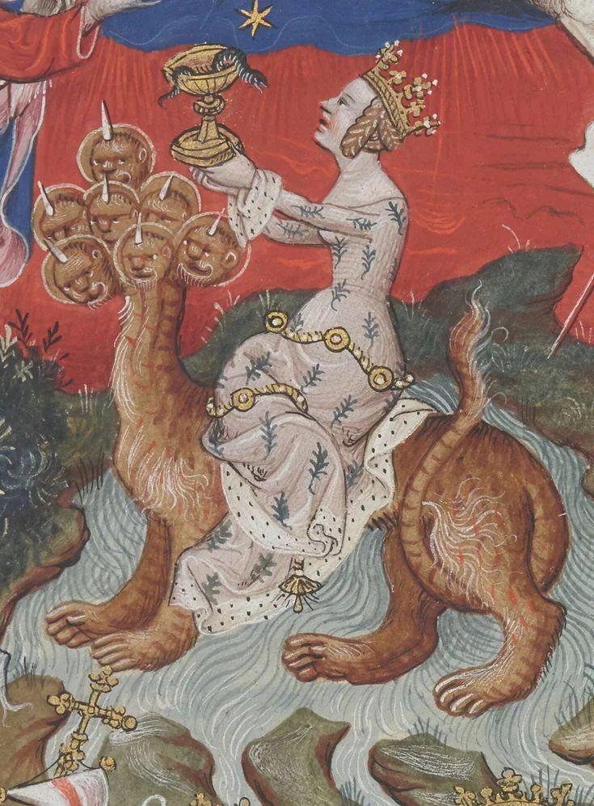
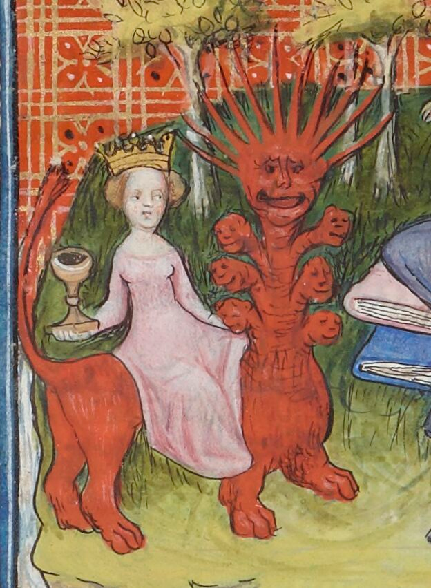

- [Foghazer - He Left the Temple](https://hypnoticdirgerecords.bandcamp.com/album/he-left-the-temple) — blackened trip-hop! sounds like Portishead in corpsepaint #[[black metal]] #atmoblack #metal #[[trip-hop]] #ambient
- medieval and Renaissance depictions of the Harlot of Babylon, from [the Epistolary and Apocalypse of Charles the Bold](https://www.themorgan.org/collection/Illuminating-Fashion/29), [the Flemish Apocalypse](https://en.wikipedia.org/wiki/Flemish_Apocalypse), and [Guyart des Moulins' Bible historiale](https://gallica.bnf.fr/ark:/12148/btv1b8458142m/f540.item.r=bible%20historiale). i like the first one's weird hat. #art #Christianity #apocalypse #weirdmedievalguys #illumination
	- {:height 508, :width 496}
	- {:height 598, :width 436}
	- {:height 591, :width 429}