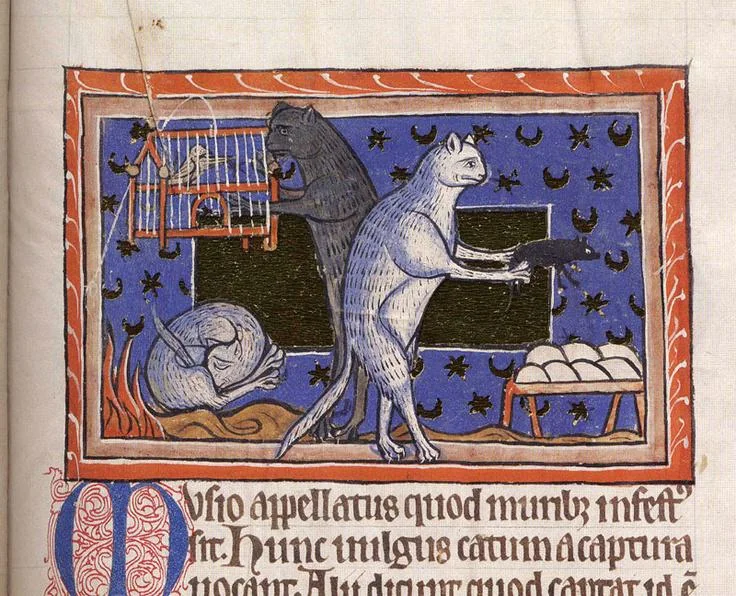

- Pavel Laptev on [the Great CSS Expansion](https://blog.gitbutler.com/the-great-css-expansion) — what previously-effortful, JS-necessitating things are now doable in plain ol' CSS? #HTML #CSS #web #[[software engineering]]
- from [MS. Bodl. 764, fol. 051r](https://digital.bodleian.ox.ac.uk/objects/ecf96804-a514-4adc-8779-2dbc4e4b2f1e/surfaces/0db6862a-cc65-4b09-996e-64ab761d43e5/), medieval cats with jobs and pets! #medieval #illumination #weirdmedievalguys #cats
	- {:height 473, :width 574}