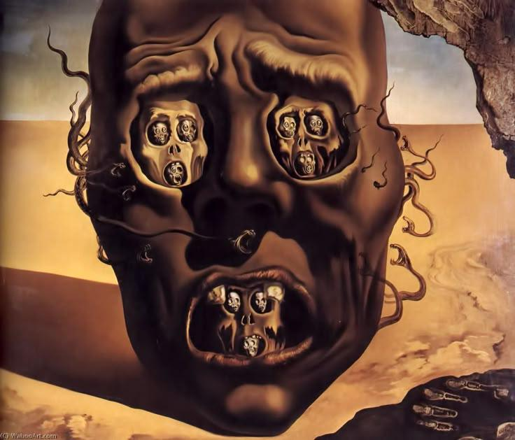

- from Google, [an RFC for JSIR, a high-level IR for JavaScript](https://discourse.llvm.org/t/rfc-jsir-a-high-level-ir-for-javascript/90456) #compilers #JavaScript #LLVM #Google
- via Mahmoud Salem, [how do you find an illegal image without looking at it?](https://mahmoud-salem.net/the-invisible-shield) on machine learning, perceptual hashing, and its role in child safety and sexual abuse materials takedowns #ml #safety #law
- Dalí's *The Face of War* #art #Dalí #war #Spain
	- {:height 401, :width 456}