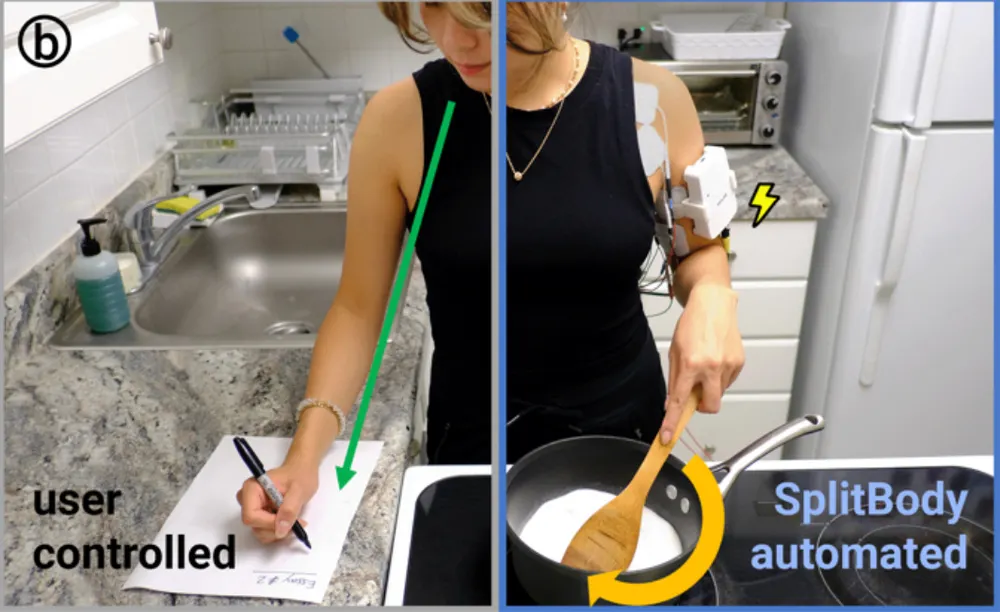

- LaurieWired [on SplitBody](https://bsky.app/profile/lauriewired.bsky.social/post/3mjadpfg3jc2r). can handing control of half your body to the machine enhance multitasking? #neuroscience #HCI #prosthetics #[[neural interfaces]] #cyborg
	- {:height 309, :width 498}
- and not _un_related... [ZeroS](https://reactormag.com/reprints-zeros-peter-watts/), by Peter Watts #[[Peter Watts]] #neuroscience #fiction #war #sci-fi #[[neural interfaces]]
- [Dragonland - A Threat from Beyond the Shadows](https://www.youtube.com/watch?v=Buzl9EKpNYM) #music #metal #[[power metal]] #sci-fi #war #Sweden