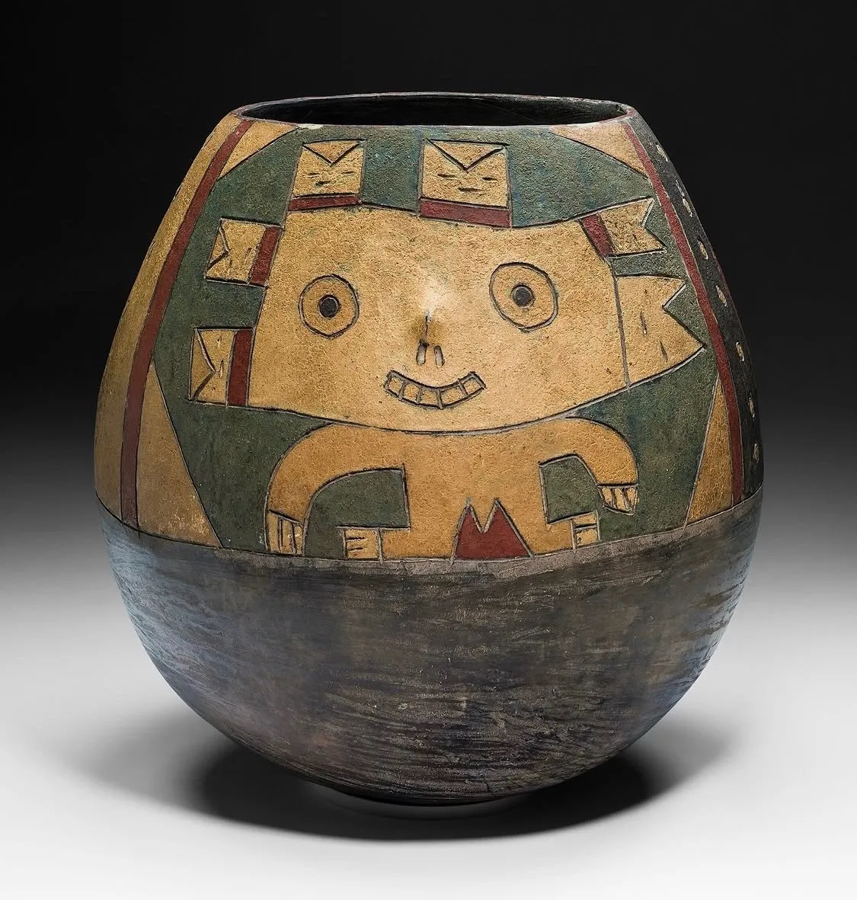

- via Blood in the Machine, [Why the AI backlash has turned violent](https://www.bloodinthemachine.com/p/why-the-ai-backlash-has-turned-violent) #AI #violence #crime #[[critique of AI]] #inequality #sociology #AI #tech
	- previously, via Anil Dash, [“I thought we’re the good guys?”](https://medium.com/humane-tech/i-thought-we-re-the-good-guys-852ff9ebd246)
- [GPT-5.4 solves an Erdős problem](https://www.erdosproblems.com/forum/thread/1196) #AI #math
- via Wikipedia, learned the history of [Powder House Island](https://en.wikipedia.org/wiki/Powder_House_Island), one of the more... _exposive_ regions of the Detroit River #history #Detroit #USA
- [via Art Institute of Chicago](https://www.artic.edu/artworks/12726/jar-with-anthropomorphic-figure), a rather excellent ancient Peruvian jug #art #weirdhistoricguys #pottery #Peru
	- {:height 454, :width 425}