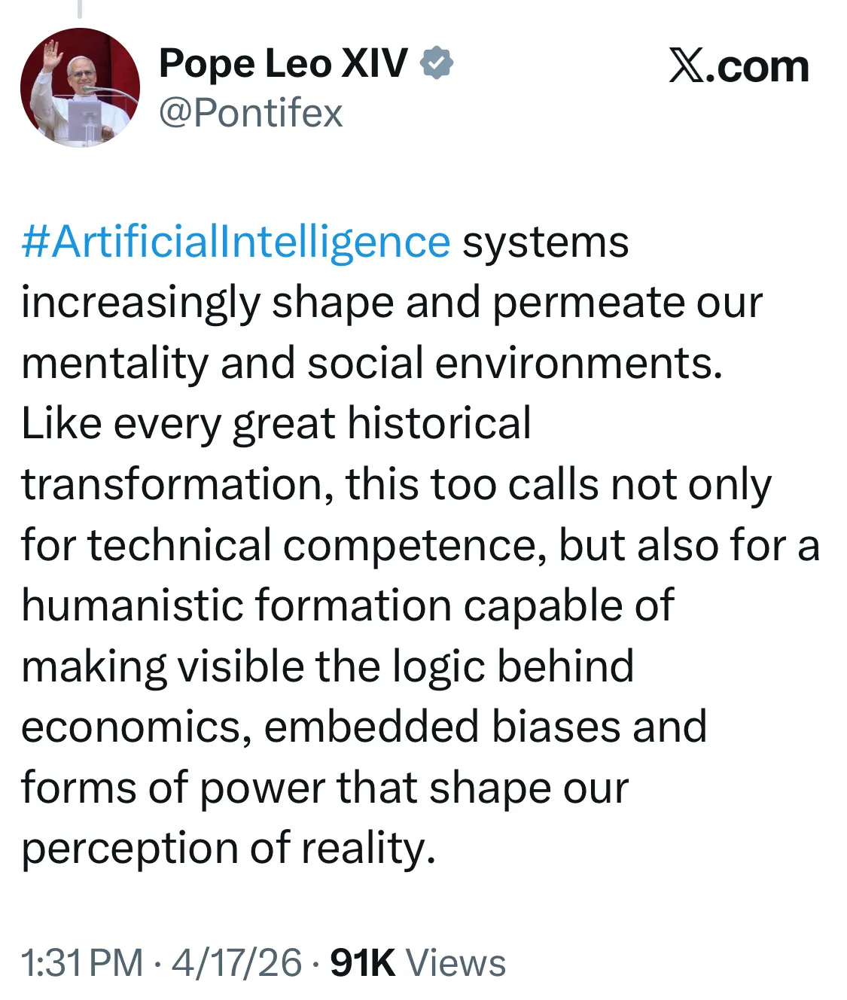
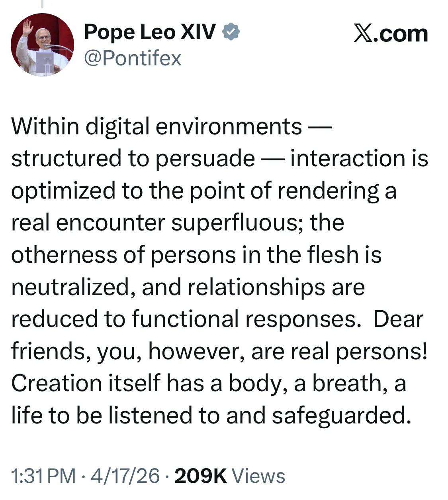
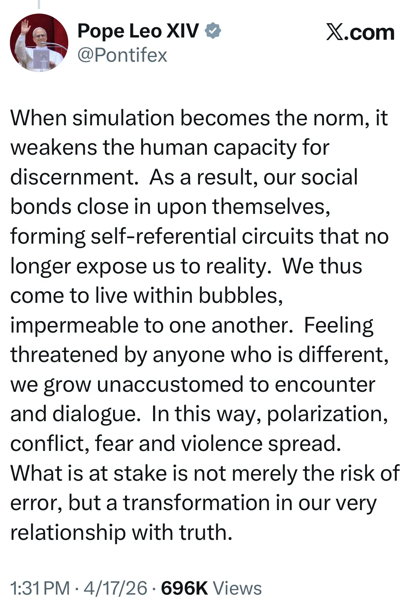

- on bread, and the human experience: [I Found It: The Best Free Restaurant Bread in America](https://www.theatlantic.com/magazine/2026/05/best-free-restaurant-bread-america/686582/) #food #humor #bread
	- related: ACOUP on [the history of bread](https://acoup.blog/2020/07/24/collections-bread-how-did-they-make-it-part-i-farmers/) #history #food #bread #agriculture
- [Trail of Bits "beats" Google's zero-knowledge proof of quantum cryptanalysis...](https://blog.trailofbits.com/2026/04/17/we-beat-googles-zero-knowledge-proof-of-quantum-cryptanalysis/) by exploiting the prover code #quantum #cryptography #security #ZKP
- [The Profession That Does Not Exist](https://thebaffler.com/odds-and-ends/the-profession-that-does-not-exist-symposium) - 7 writers for the Baffler on the nonexistence of writing as a career and the pain of the side-gig #writing #work #journalism #fire #[[social media]] #biography
- [Pope Leo on AI](https://xcancel.com/Pontifex/status/2045208457440059414#m) #Catholicism #[[critique of AI]] #[[critique of technology]] #sociology #Christianity
	- {:height 589, :width 296}
	- {:height 496, :width 294}
	- {:height 448, :width 292}