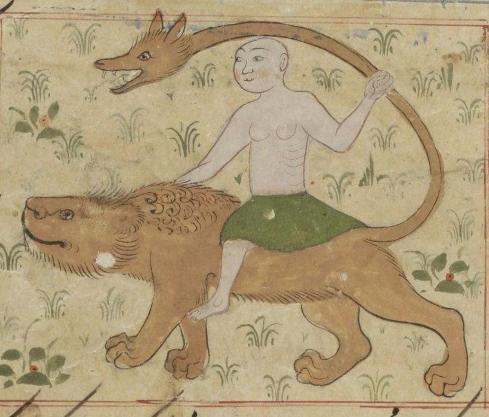

- learned about Sir [Josef Menčík](https://en.wikipedia.org/wiki/Josef_Men%C4%8D%C3%ADk), the Czech Don Quixote, who rode out from his castle against the Nazi invasion of the Sudetenland with armour and lance #history #Czechia #WWII
- [Fires in the Distance - Of Radiance and Levitation](https://www.youtube.com/watch?v=QjC-HKNuF9I) #metal #music #melodeath #USA
- via Alex Imas, [Who Uses AI (and How)?](https://aleximas.substack.com/p/who-uses-ai-and-how) #AI #[[technology adoption]] #ergonomics #[[developer experience]]
- Sagittarius, as represented in an illumination of al-Qazwini #illumination #al-Qazwini #weirdhistoricguys #Iran #art #Zodiac
	- {:height 461, :width 528}