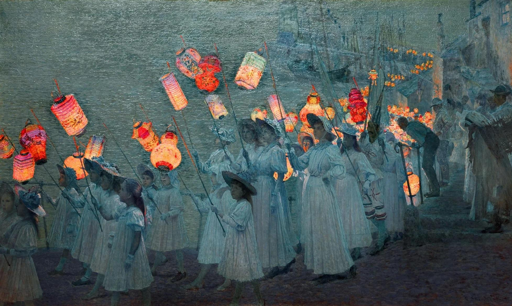

- SE Gyges [on clowns](https://segyges.github.io/posts/on-clowns/) in the sphere of mass communication #communication #[[social media]] #sociology
- via The Verge, [Silicon Valley has forgotten what normal people want](https://www.theverge.com/tldr/915176/nft-metaverse-ai-weirdos) #tech #culture #product #[[Silicon Valley]]
- Ashley Rolfmore requests, [stop trying to engineer your way out of listening to people](https://ashley.rolfmore.com/stop-trying-to-engineer-your-way-out-of-listening-to-people/) #communication #[[engineering management]]
- Jubilee Procession in a Cornish Village #art #UK #Cornwall #[[George Sherwood Hunter]]
	- {:height 383, :width 633}