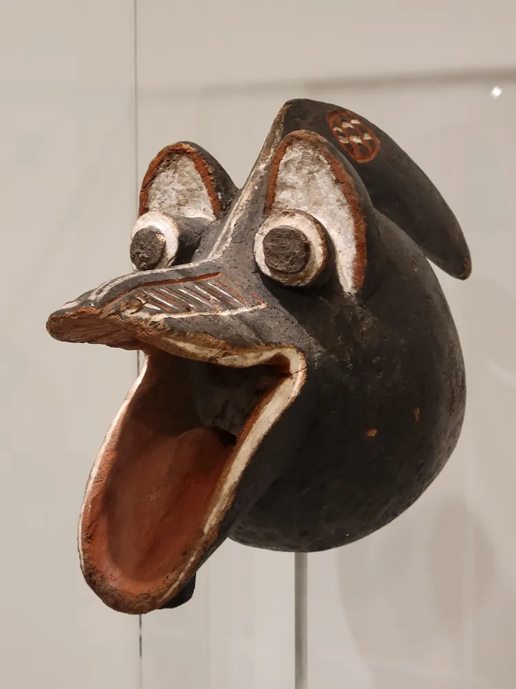

- [Navigating the Thicket: Why DeepSeek-V4 Trains Specialists Instead of One Model](https://sotaverified.org/blog/navigating-the-thicket) #DeepSeek #MOEs #LLMs #[[training (ml)]]
- Ted Nyman on [high-performance Git](https://gitperf.com/) #learning #Git #[[platform engineering]] #performance #books
- from the Baltimore Museum of Art, the ur-pogchamp! (in fact, a Mambila nsua-ndua.) #art #masks #Nigeria #weirdhistoricguys
	- {:height 471, :width 347}