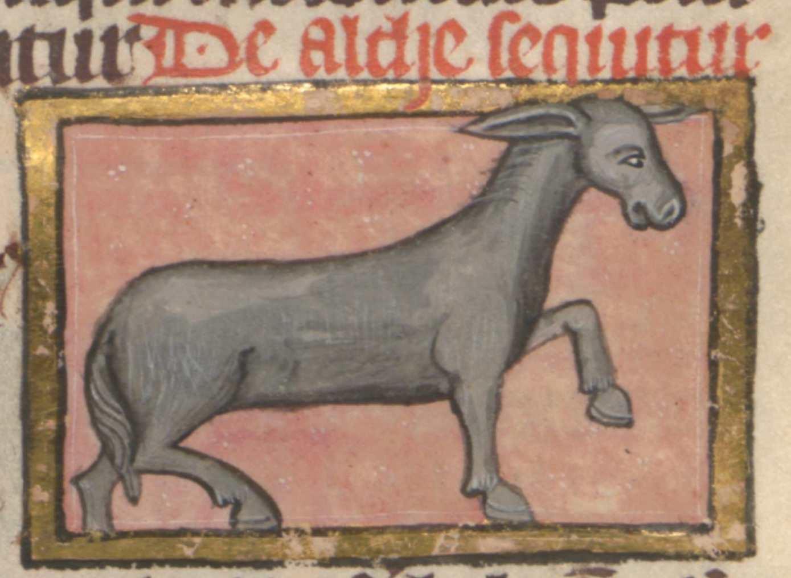
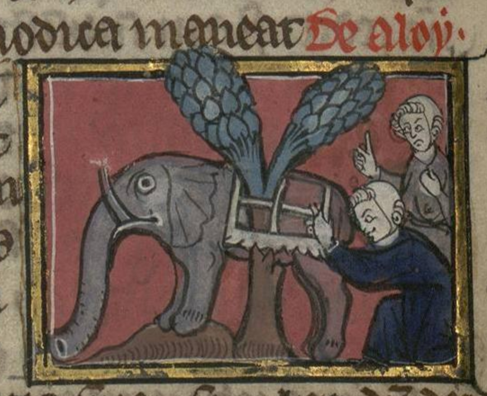
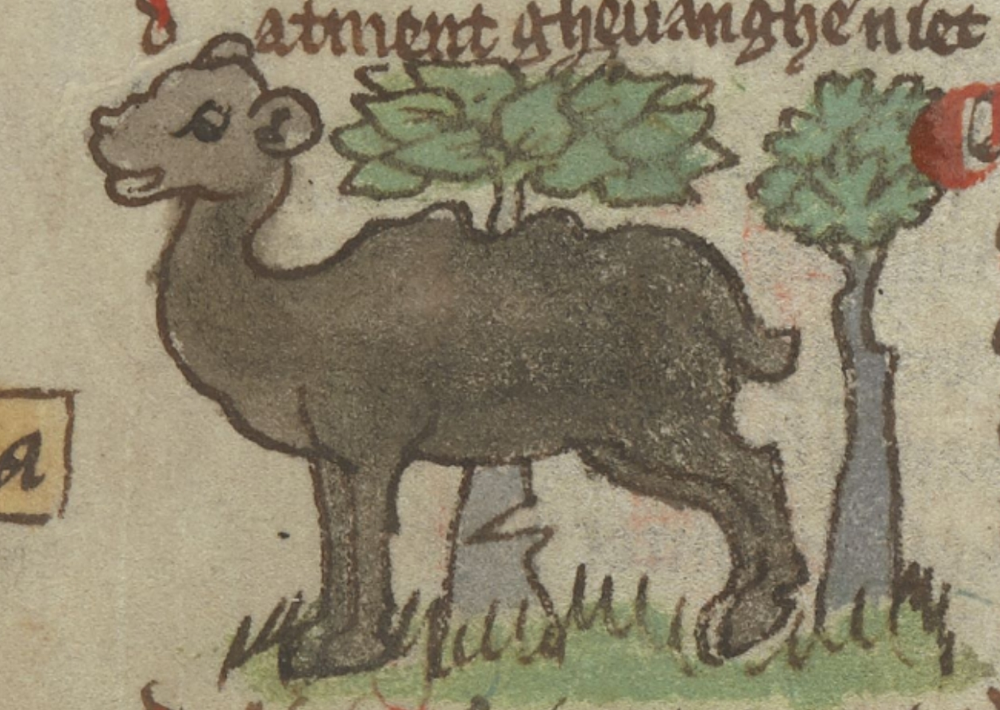

- [Ponte del Diavolo - Spirit, Blood, Poison, Ferment](https://pontedeldiavolo666.bandcamp.com/track/spirit-blood-poison-ferment). pretty good for those who liked Messa last year #[[black metal]] #[[doom metal]] #[[gothic rock]] #music #metal #Italy
- it seems the missing productivity dark matter may have appeared - via Gizmodo, [the Apple App Store sees a surge in apps](https://gizmodo.com/apple-app-store-experiences-surge-in-new-apps-amid-vibe-coding-boom-2000742653)
	- last time: ((68ce1563-40ea-44db-98b8-30476f381c73))
- a variety of... *unique* [medieval depictions of elk](https://bestiary.ca/beasts/beastgallery106127.htm) #art #illumination #weirdhistoricguys #medieval
	- {:height 304, :width 407}
	- {:height 344, :width 421}
	- {:height 303, :width 430}