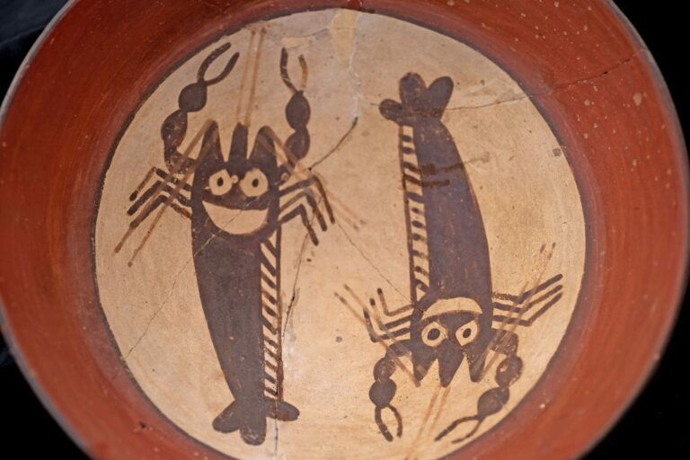

- newish web animation resource - Josh Comeau's [Whimsical Animations](https://whimsy.joshwcomeau.com/) #web #CSS #learning #animation #[[software engineering]] #design
- [llama.ttf](https://fuglede.github.io/llama.ttf/), the LLM that's also a font file! #typography #LLMs #AI #weird #humour
- via the Museum of Anthropology at UBC, ancient Peruvian happy shrimp! #weirdhistoricguys #art #pottery #Peru
	- {:height 341, :width 511}