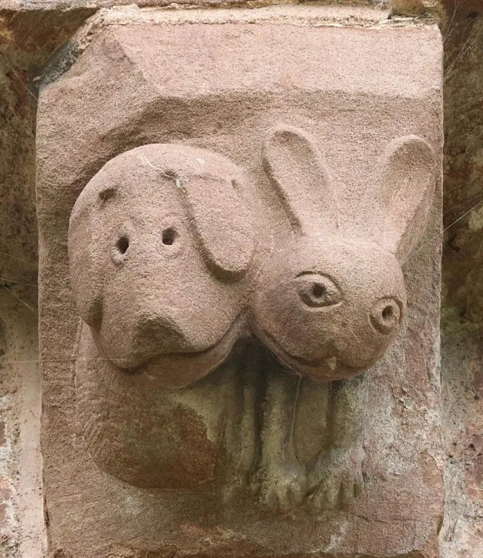

- via the BBC, [hereditary peers' last hurrah](https://www.bbc.com/news/articles/ckgp5j5gpplo) - after reform of the right of hereditary peers to sit in the House of Lords in 1999, the last 92 have been removed. #UK #politics #aristocracy
- [Khemmis - Invocation of the Dreamer](https://khemmis.bandcamp.com/track/invocation-of-the-dreamer) #[[doom metal]] #music #metal #USA
- Cat Hicks on cognitive helmets for the AI bicycle: [1](https://www.fightforthehuman.com/cognitive-helmets-for-the-ai-bicycle-part-1/), [2](https://www.fightforthehuman.com/cognitive-helmets-for-the-ai-bicycle-part-2-the-sometimes-wrong-bot/) #metacognition #psychology #AI #learning #HCI
- from the Church of St. Mary & David in Kilpeck, medieval Sam & Max! #art #weirdhistoricguys #dogs #rabbits #sculpture #churches
	- {:height 673, :width 576}