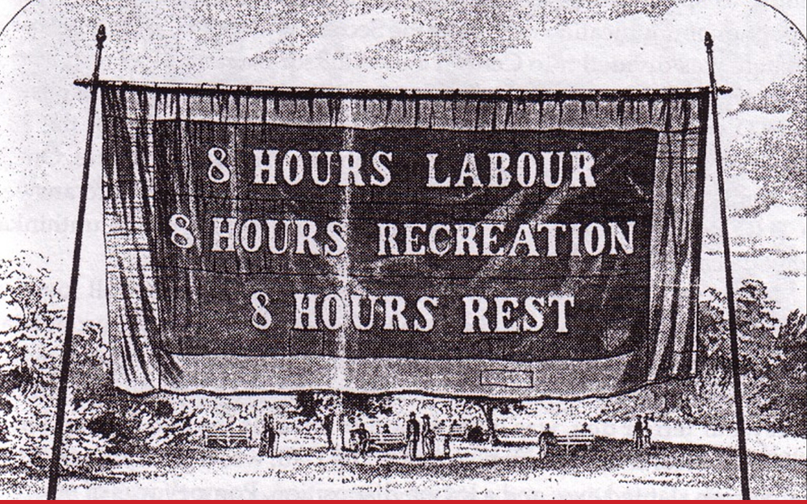
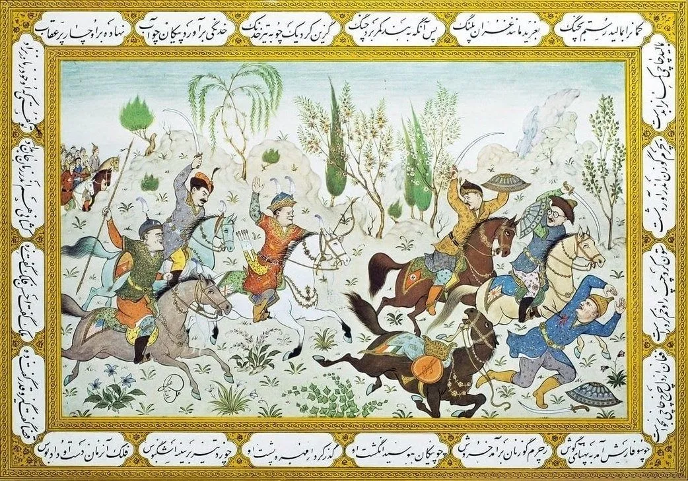

- for this May Day, the banner of the [8-hour procession in Melbourne](https://en.wikipedia.org/wiki/Eight-hour_day_movement#Australia) #history #labor #socialism #unions #Australia
	- 
- Resilience in Software Foundation on [superficial blamelessness](https://resilienceinsoftware.org/news/11502437) #blameless #resilience
- MIT Technology Review on [the case for fixing everything](https://www.technologyreview.com/2026/04/17/1135408/book-review-stewart-brand-fixing-everything-maintenance/) - does Stewart Brand's "Maintenance: Of Everything" hold up? #books #maintenance
- interesting historical ephemera: a 1940s classically-styled Iranian poster depicting the Allies routing the Axis #war #art #WWII #Iran
	- {:height 415, :width 581}