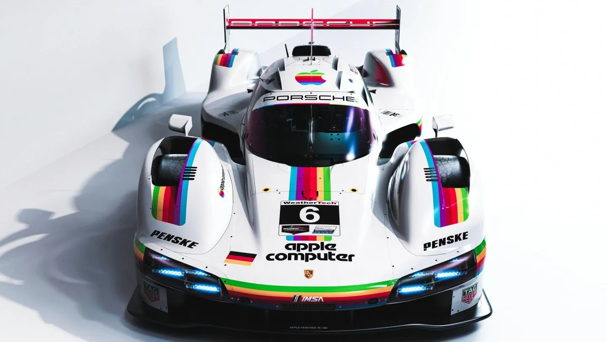
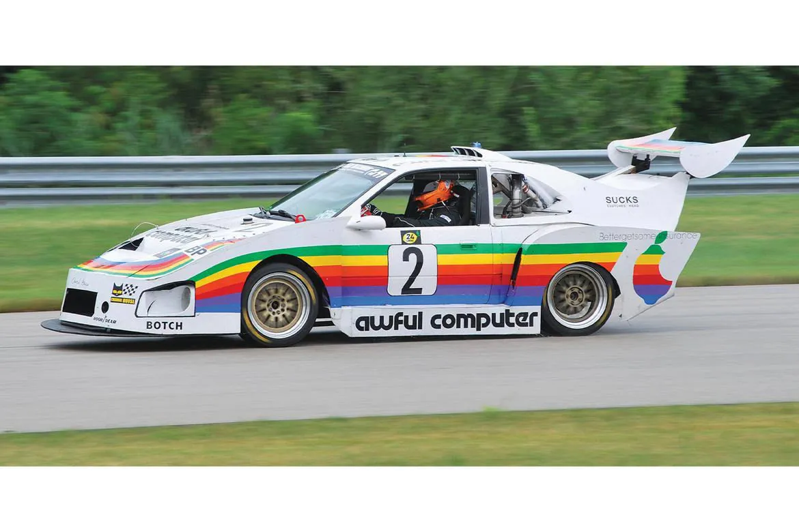
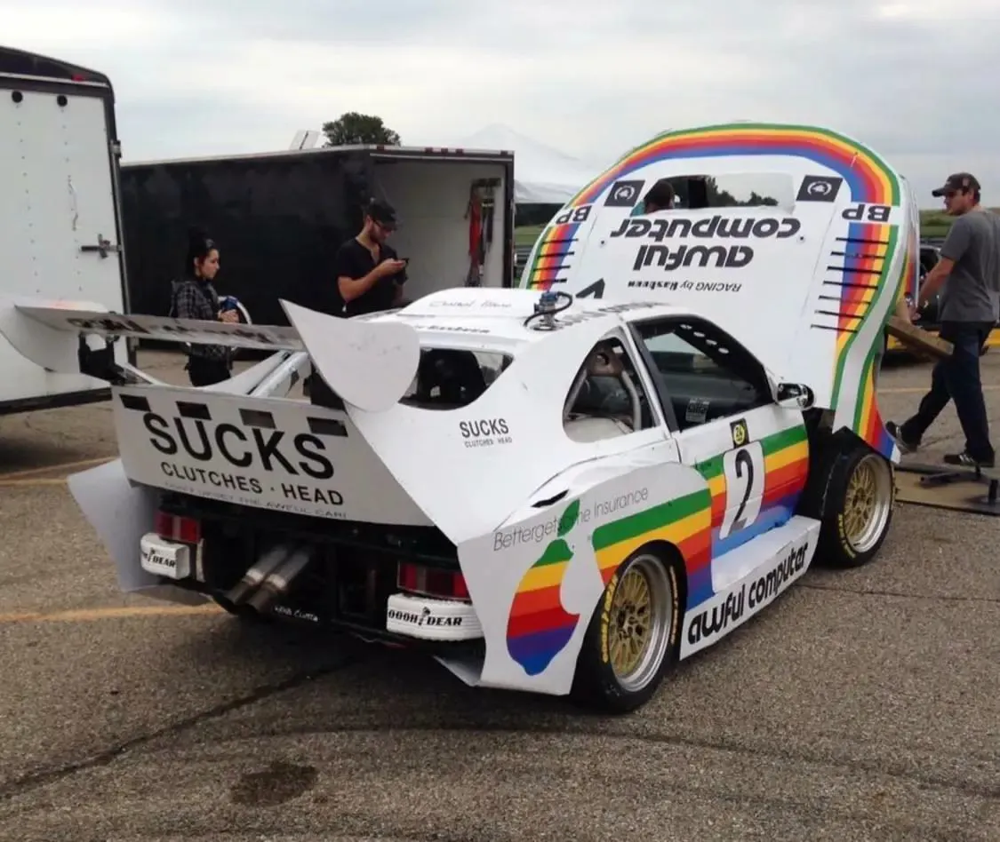

- learned about this nice [unofficial NixOS & Flakes book](https://nixos-and-flakes.thiscute.world/) #learning #books #Nix
- cekrem on [architecture by autocomplete](https://cekrem.github.io/posts/architecture-by-autocomplete/) #[[critique of AI]] #[[software architecture]] #[[software engineering]] #APIs #[[type systems]]
- [Unverkalt - Oath Ov Prometheus](https://unverkalt.bandcamp.com/track/oath-ov-prometheus) #music #metal #post-metal #blackgaze #Greece #Germany
- learned about the Porsche 1980 Apple livery #cars #Apple #design
	- {:height 308, :width 498}
	- and its more recent parody in the 24 Hours of Lemons:
	- {:height 337, :width 496}
	- {:height 424, :width 495}