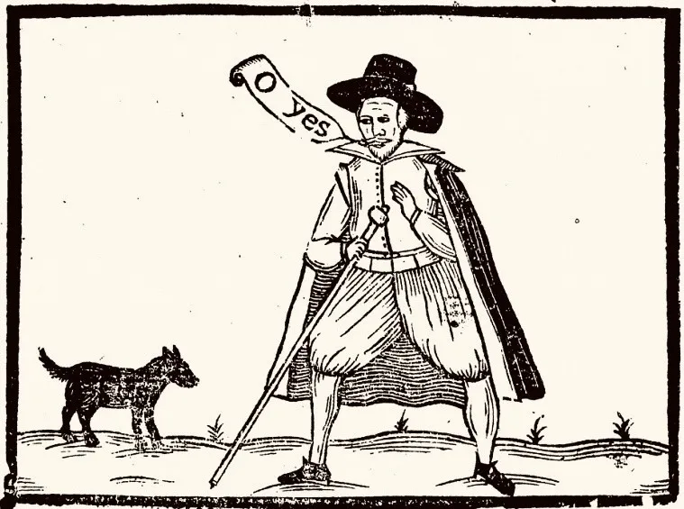

- Steve Yegge rides the Gas Town train to [Gas City](https://steve-yegge.medium.com/welcome-to-gas-city-57f564bb3607). not clear to me what this solves that more normal agent orchestration techniques don't, but one must keep up with the avant le lettre i suppose #AI #[[AI coding assistants]] #vibecoding
- [A Forest of Stars - Sway, Draped in Vague](https://a-forest-of-stars.bandcamp.com/track/sway-draped-in-vague) #music #[[black metal]] #atmoblack #[[prog metal]]
- Mozille Hacks on [hardening Firefox with Claude Mythos](https://hacks.mozilla.org/2026/05/behind-the-scenes-hardening-firefox/) #security #browsers #AI #[[AI coding assistants]] #Mozilla #Anthropic
- what you say when you see a dog (i _think_ from the Pepys Ballads but cannot find where) #weirdhistoricguys #woodcut #Elizabethan #art #dogs
	- 