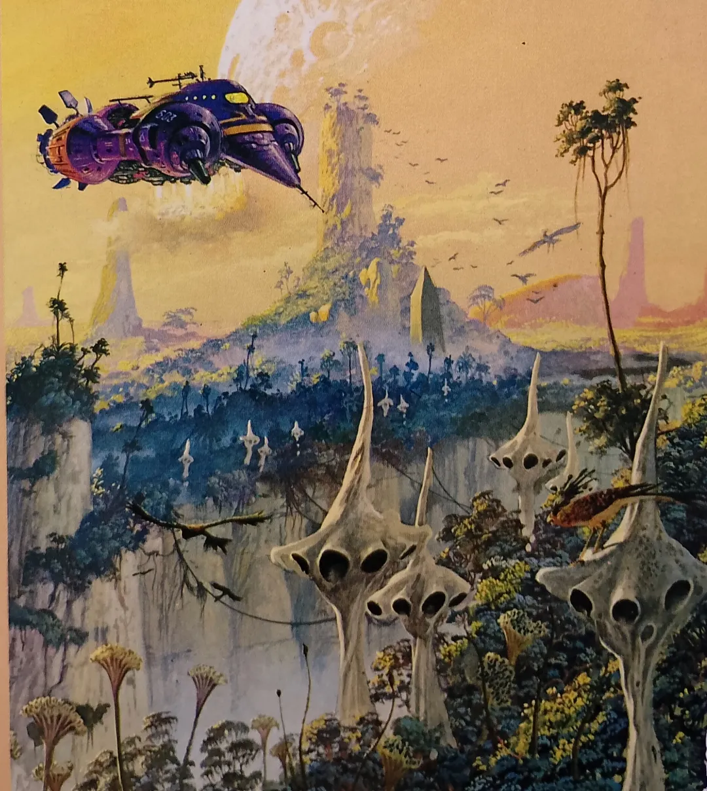

- Niko Matsakis on [Symposium](https://nikomatsakis.github.io/gosim-paris-2026), the Rust toolchain for agentic development #Rust #AI #[[AI agents]] #[[AI coding assistants]]
- fresh from Panopticon, [Woodland Caribou](https://thetruepanopticon.bandcamp.com/track/woodland-caribou) #music #metal #[[black metal]] #atmoblack #USA
- learned about some rather horrifying recent Linux exploits: #security #linux
	- [Copy Fail](https://copy.fail/)
	- [Dirty Frag](https://github.com/V4bel/dirtyfrag)
- Colin Andrews' cover detail for *The Earth Book of Stormgate One* #art #sci-fi #[[Colin Andrews]]
	- {:height 493, :width 435}