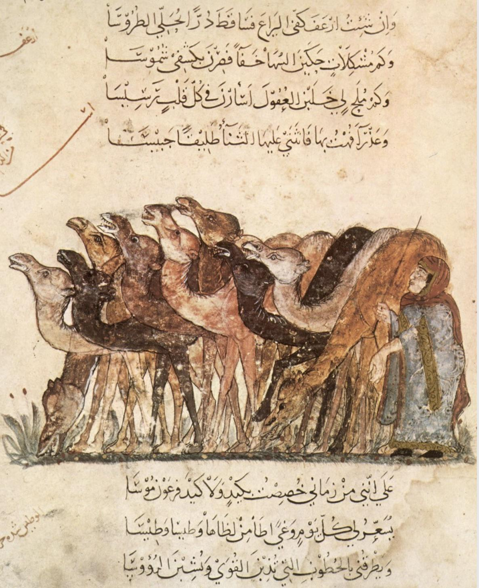

- [rite](https://rite.mino.mobi/lexicon/), an editing drill app. practice your craft! hone brevity! #writing #learning #apps #editing #brevity
- Reiner Pope asks, [why are neural networks and cryptographic ciphers so similar?](https://reiner.org/neural-net-ciphers) #LLMs #AI #[[neural network]] #cryptography
- a group of camels w/ shepherd, from a manuscript of *maqāma* #art #camels #medieval #illumination
	- {:height 541, :width 436}