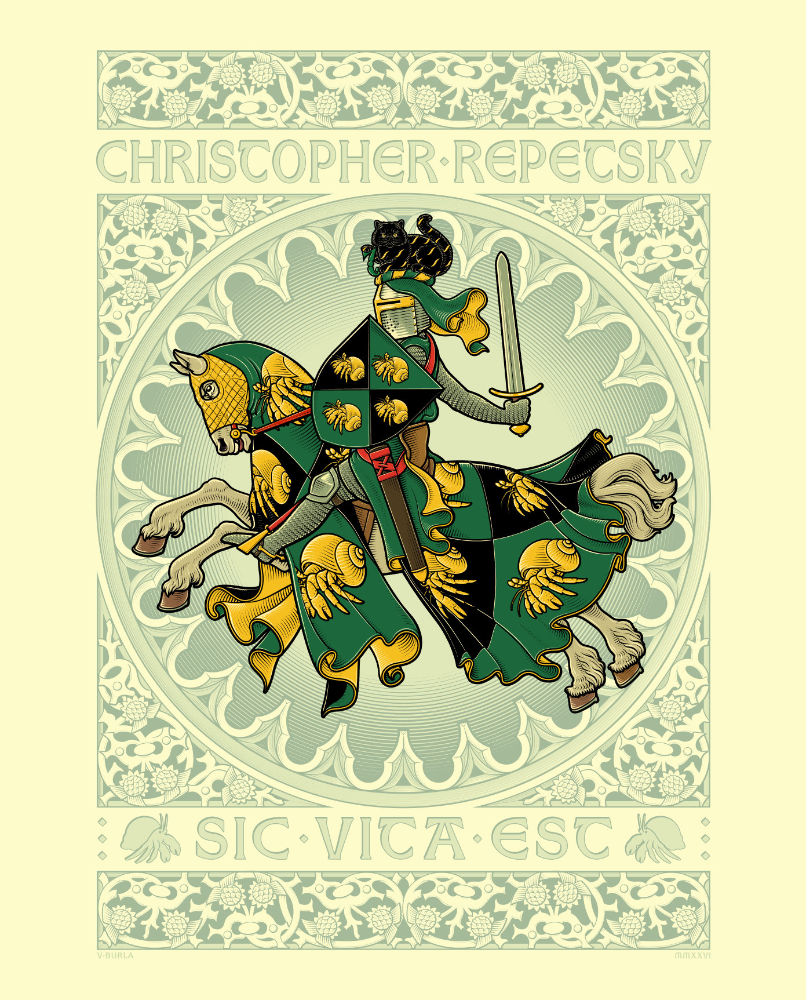

- via Noema, [We need to rewild the internet](https://www.noemamag.com/we-need-to-rewild-the-internet/) #internet #culture #tech #ecology #rewilding #[[James C. Scott]] #monopoly #complexity #[[history of technology]] #[[Elinor Ostrom]]
	- > Ecologists have reoriented their field as a “crisis discipline,” a field of study that’s not just about learning things but about saving them. We technologists need to do the same. Rewilding the internet connects and grows what people are doing across regulation, standards-setting and new ways of organizing and building infrastructure, to tell a shared story of where we want to go. It’s a shared vision with many strategies. The instruments we need to shift away from extractive technological monocultures are at hand or ready to be built.
- learning about recursive LMs: #papers #LLMs #recursion #[[training (ml)]]
	- Khataab & Zhang - [Recursive Language Models](https://alexzhang13.github.io/blog/2025/rlm/)
	- Kim & Ahmad - [Reinforcing Recursive Language Models](https://www.alphaxiv.org/blog/reinforcement-learning-for-rlms)
- [via Reddit](https://www.reddit.com/r/heraldry/comments/1qsu69r/an_equestrian_design_i_made_for_christopher/), a *gorgeous* equestrians achievement for Christopher Repetsky #heraldry #art
	- {:height 450, :width 360}
- [In Vain - Against the Grain](https://invainband.bandcamp.com/track/against-the-grain-2) #music #metal #[[death metal]] #melodeath #Norway