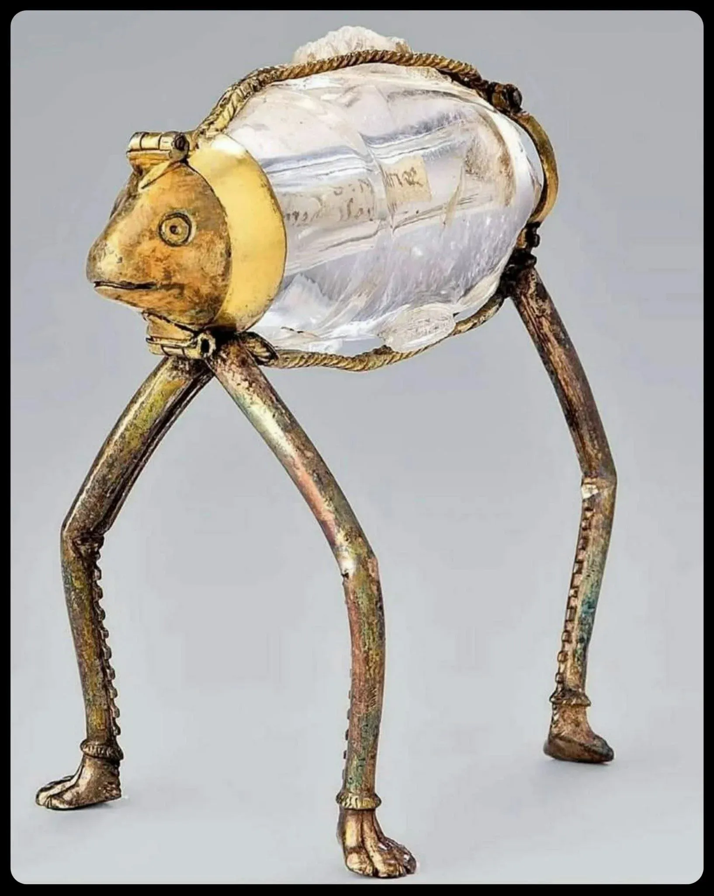

- Oxide Computer [has a sick 3D explorer](https://bsky.app/profile/benleonard.bsky.social/post/3mlleonl42s2h): https://explorer.oxide.computer/ #web #design #frontend #3D #graphics #animation
- Ai2 [launches EMO](https://allenai.org/blog/emo), a _modular_ mixture-of-experts model #LLMs #AI #[[open source]] #MOEs #modularity
- [Deadtrees - Extinguished City](https://deadtreescn.bandcamp.com/track/extinguished-city-2) #music #post-rock #post-metal #China
- [via Reddit](https://www.reddit.com/r/ArtefactPorn/comments/1rdi6u0/reliquary_in_the_shape_of_a_threelegged_fish_from/), three-legged fish reliquary! #weirdhistoricguys #Catholicism #fish #art
	- {:height 645, :width 508}
- learned about [Trellis](https://trellis.unfoldml.com/), a system for running private compute grid for inference #[[platform engineering]] #MLOps #[[grid computing]] #AI #distsys
- [Termitennae I: Embedden](https://riverrun.leaflet.pub/3mkogu5jyks2x) #weird #fiction #insects #AI #sci-fi #poetry