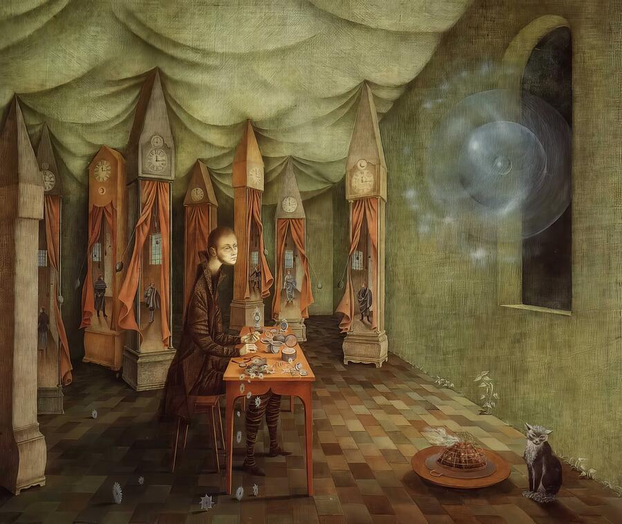

- sudgylacmoe on why [tensors are too intuitive](https://www.youtube.com/watch?v=NOb8dCMP0Ys) #math #tensors #video
- ByteDance [releases Lance](https://lance-project.github.io/), a 3B unified multimodal model trained on just 128 GPUs #ByteDance #AI #LLM #LVM #[[unified models]]
- [Insurrect - Nomadic War Machine](https://insurrect.bandcamp.com/album/nomadic-war-machine) #music #[[war metal]] #Deleuze #anarchism #metal
- [Anthropic is now profitable](https://www.wsj.com/tech/ai/mind-blowing-growth-is-about-to-propel-anthropic-into-its-first-profitable-quarter-7edbf2f4) #AI #tech #Anthropic
- *The Revelation* #art #[[Remedios Varo]] #surrealism #Mexico
	- {:height 475, :width 549}