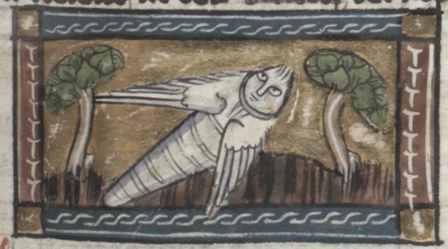

- learned about [Braintrust](https://www.braintrust.dev/), a pretty solid service for LLM evals and o11y #LLM #AI #benchmarks #observability #[[developer tooling]]
- Anthropic on [a "diff" tool for AI](https://www.anthropic.com/research/diff-tool) - the Dedicated Feature Crosscoder #interpretability #AI #LLM #Anthropic
- from [Der Naturen Bloeme](https://pdimagearchive.org/images/52b88da7-d0c9-4b5e-9f5e-e7bc760d9914/), a _supposed_ firefly #weirdhistoricguys #medieval #illumination #art #Netherlands #insects
	- {:height 368, :width 648}