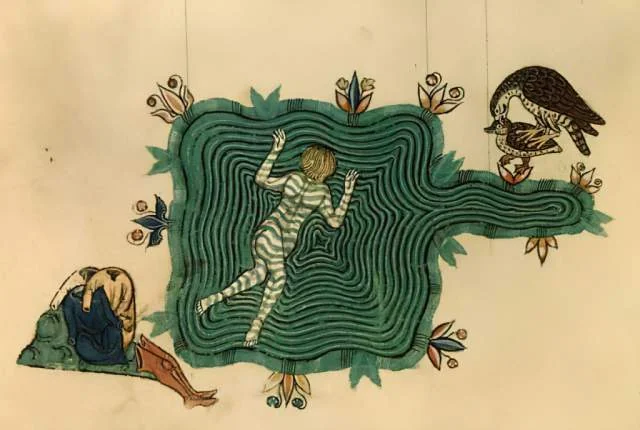

- in honor of Sonny Rollins, who passed today, [Saxophone Colossus](https://www.youtube.com/watch?v=1BBcGemV9mY) #jazz #USA #music #[[hard bop]]
- Pope Leo publishes [Magnifica Humanitas](https://www.vatican.va/content/leo-xiv/en/encyclicals/documents/20260515-magnifica-humanitas.html) on safeguarding the human person in the time of AI. [Chris Olah from Anthropic](https://www.youtube.com/watch?app=desktop&v=ORFrdYSvzuw&ra=m) and [Leo](https://www.youtube.com/watch?app=desktop&v=c41idPquxrE&ra=m) both present #AI #Catholicism #Christianity #Anthropic #[[critique of AI]] #[[philosophy of technology]] #[[history of technology]] #religion
	- fun fact: this is also the first time Gandalf was quoted in Catholic doctrine! #Tolkien
- gorgeous illumination of a swimmer from Frederick II's *De arte venandi cum avibus* #illumination #medieval #art #[[Frederick II]]
	- 