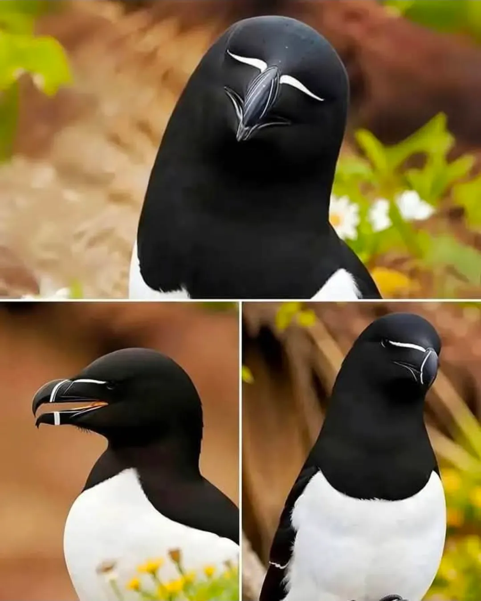

- through early solar adoption, [Spain's become one of Europe's cheapest power markets](https://janrosenow.substack.com/p/spain-just-became-one-of-europe)! #solar #energy #Spain #environmentalism
- Ben Eggers argues, [nothing has changed about software engineering](https://www.youtube.com/watch?v=lxDRDORvFdE) in the era of AI #[[software engineering]] #AI #[[AI coding assistants]] #talks #video
- at Stanford, [gamers are now citizen scientists](https://med.stanford.edu/news/all-news/2016/02/journal-to-publish-paper-by-video-gamers.html), with a co-author paper credit on RNA folding #gaming #gamification #biology #RNA #Stanford
- bird of the day: the razorbill #birds
	- {:height 664, :width 524}