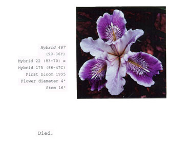

- learned about [George Gessert](https://geneticsandculture.com/genetics_culture/pages_genetics_culture/gc_w02/gc_w02_gessert.htm), the artist whose art is hybridizing irises #art #flowers #horticulture
	- 