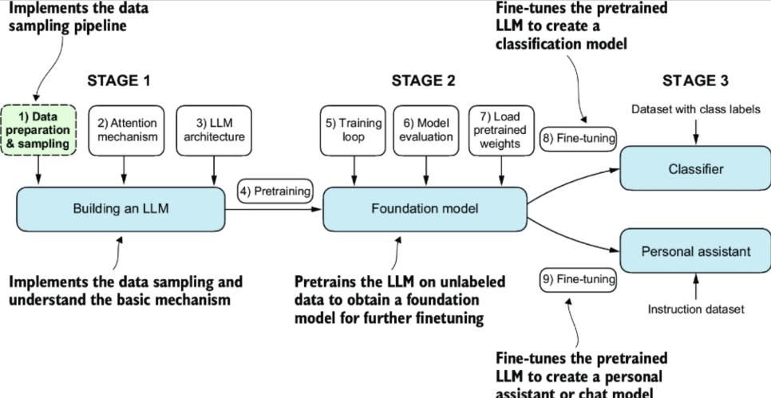

- # Chapter 1: Understanding LLMs
	- an [[LLM]] is a [[deep neural network]] built to understand, generate, and respond to human language. they're "large" both in the sense of their massive parameter size (billions) and the massive corpora they must be trained on
	- LLMs typically use the [[transformer]] architecture
	- LLMs are useful for all kinds of things- not just generative content, but [[machine translation]], summarization, search...
	- nowadays, [[PyTorch]] is the most common tool for building these sorts of models.
		- (mildly sad to hear that my beloved [[Keras]] ain't in the game)
	- constructing these models is a 2-step process:
		- **[[pretraining]]**, in which we toss a huge amount of raw text at it for some [[self-supervised learning]], so it can model the general structure of language. the result of this stage is a [[foundation model]], which can then be further trained for more specific purposes in the next step.
		- **[[fine-tuning]]**, in which we sculpt the model to do what we want with some [[supervised learning]]. we might train it for [[classification]] by giving it a bunch of labeled examples, or we might do instruction fine tuning with pairs of inputs and desired results (e.g. for translation)
	- you need oodles of data to build one o' these. stuff like [[CommonCrawl]]
	- we're gonna build our own! we'll do it in 3 stages:
		- build the attention mechanism
		- build and pretrain an LLM using that attention mechanism
		- fine-tune a pretrained LLM on a specific task
		- 
- # Chapter 2: Working with text data
	- before we can build an LLM, we need data! that data will be text. lots and lots of text.
	- it can't just be TXT files, though- we need ways to chop it up into tokens, then vectorize those tokens into a representation the LLM can work with
		- in a sense, we're converting the [[categorical]] data that is text into [[numeric]] data
	- an **embedding** maps discrete items, like text, into a continuous vector space. that's the thing we need.
		- these aren't just used at the word or subword level, and not just in prepping text for training! they might be used at the sentence or paragraph level in [[RAG]], for example
	- to do this we need a [[tokenizer]].
		- we can make a simple tokenizer by splitting the text into words and punctuation, taking the set unique items, sorting it, then mapping each item to its index in order. we can then encode and decode into numerical identifiers
	- we will probably want some [[special tokens]], like `<|endoftext|>` for the end of the input, and `<|unk|>` to handle unknown input
		- we might want others, like `<|BOS|>`/`<|EOS|>` for the beginning and end of sequences, or `<|PAD|>` for padding texts out to an equal length.
	- [[byte pair encoding]] is a more sophisticated method
-