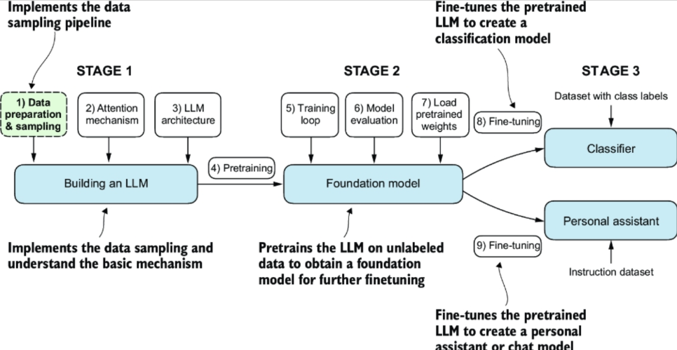
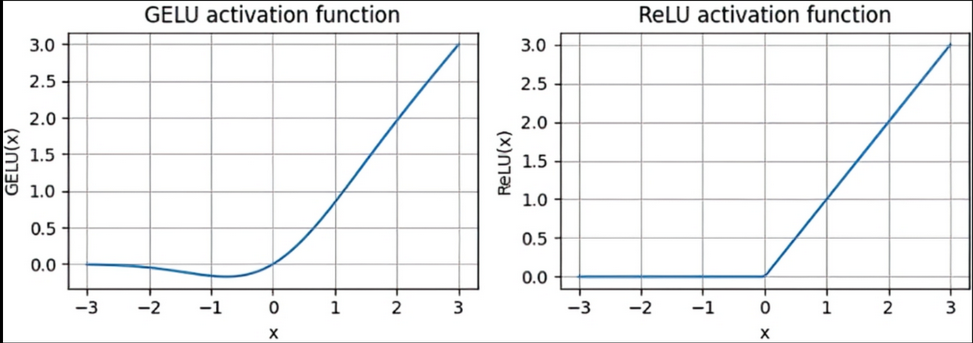

- # Chapter 1: Understanding LLMs
	- an [[LLM]] is a [[deep neural network]] built to understand, generate, and respond to human language. they're "large" both in the sense of their massive parameter size (billions) and the massive corpora they must be trained on
	- LLMs typically use the [[transformer]] architecture
	- LLMs are useful for all kinds of things- not just generative content, but [[machine translation]], summarization, search...
	- nowadays, [[PyTorch]] is the most common tool for building these sorts of models.
		- (mildly sad to hear that my beloved [[Keras]] ain't in the game)
	- constructing these models is a 2-step process:
		- **[[pretraining]]**, in which we toss a huge amount of raw text at it for some [[self-supervised learning]], so it can model the general structure of language. the result of this stage is a [[foundation model]], which can then be further trained for more specific purposes in the next step.
		- **[[fine-tuning]]**, in which we sculpt the model to do what we want with some [[supervised learning]]. we might train it for [[classification]] by giving it a bunch of labeled examples, or we might do instruction fine tuning with pairs of inputs and desired results (e.g. for translation)
	- you need oodles of data to build one o' these. stuff like [[CommonCrawl]]
	- we're gonna build our own! we'll do it in 3 stages:
		- build the attention mechanism
		- build and pretrain an LLM using that attention mechanism
		- fine-tune a pretrained LLM on a specific task
		- 
- # Chapter 2: Working with text data #NLP
	- before we can build an LLM, we need data! that data will be text. lots and lots of text.
	- it can't just be TXT files, though- we need ways to chop it up into tokens, then vectorize those tokens into a representation the LLM can work with
		- in a sense, we're converting the [[categorical]] data that is text into [[numeric]] data
	- an **embedding** maps discrete items, like text, into a continuous vector space. that's the thing we need.
		- these aren't just used at the word or subword level, and not just in prepping text for training! they might be used at the sentence or paragraph level in [[RAG]], for example
	- to do this we need a [[tokenizer]].
		- we can make a simple tokenizer by splitting the text into words and punctuation, taking the set unique items, sorting it, then mapping each item to its index in order. we can then encode and decode into numerical identifiers
	- we will probably want some [[special tokens]], like `<|endoftext|>` for the end of the input, and `<|unk|>` to handle unknown input
		- we might want others, like `<|BOS|>`/`<|EOS|>` for the beginning and end of sequences, or `<|PAD|>` for padding texts out to an equal length.
	- [[byte pair encoding]] is a more sophisticated method
	- to do word prediction, we want a dataset of input-target pairs, which we can produce with a pair of sliding windows spaced one token apart.
	- we'll use an embedding layer to convert tokens into embedding vectors.
		- this works much like [[one-hot encoding]] plus matrix multiplication, but we let the NN optimize it
		- [[PyTorch]]'s `torch.nn.Embedding` can do this
	- but word embeddings isn't enough. sentences are ordered, so we need position information if we're gonna retain all the information.
		- there are two types we could use. an _absolute_ position-aware embedding assigns a unique embedding to each position. a _relative_ position-aware embedding instead assigns embeddings based on the distance between tokens.
- # Chapter 3: Coding attention mechanisms #[[attention (ml)]]
	- now that we have a dataset, we need the mechanisms that we'll build the neural network on
	- why do we need attention?
		- suppose we're doing [[machine translation]]. it's not possible to do word-for-word translation, because that's not how language works! we need context from elsewhere in the sentence, word order, etc.
		- typically, we use [[encoder-decoder models]]
		- in the past, we'd use [[RNN]]s, which can handle sequential information. the encoder RNN stores that information in a hidden context, then the decoder RNN uses that hidden state as its initial state. but they're very limited! the RNN has only one hidden state at a time, which needs to encapsulate the _entire_ context.
	- attention mechanisms can give us direct access to previous tokens of the input. this was first done by Bahndau et al, who added an attention mechanism to an RNN. that mechanism let the decoder access all the input tokens selectively.
		- but... we discovered that you don't really need the RNN to make this work. just attention is enough. [[transformer]] models use **self-attention**, in which each position of a sequence can determine the relevance of each other position in that sequence.
		- we call it *self*-attention as opposed to, say, [[sequence-to-sequence]] models, where we pay attention to a _different_ sequence
	- how do we make attention trainable?
		- with thee trainable weigh matrices, $W_q$, $W_k$, & $W_v$, which project each token into query, key, and value vectors
		- query - think asking "what's relevant to me?
		- key - think advertising "what do i represent?"
		- value - think offering up "here's my actual information"
		- all are transformations of the same input, and we allow the model to learn each of these all on its own
	- we might want **causal attention**, where attention for each token only considers previous tokens when predicting the next one. this is not that complex: we can just multiply against a triangular mask that's zeroed out above the diagonal, then renormalize rows to sum to 1
		- it might _seem_ like info would leak, since we still compute the full attention matrix. but it doesn't! the renormalization eliminates any meaningful info that woulda been there.
		- instead of normailzing by dividing by the row sum, we can use mask that's -inf above the diagonal, the just take the softmax again. this does the same thing in fewer steps.
	- using [[dropout]]
		- we might want to mask more units during training to prevent overfitting. dropout can do that.
		- typically, you'd either do this after calculating attn weights, or after applying them to the values
		- we can balance the dropout by scaling all remaining weights up by $1 / a$, where $a$ is the dropout rate.
	- **multi-head attention** is useful if you want the layer to learn more complex pattern recognition, like patterns at very different scales
		- effectively, it's just "stacking multiple causal attention heads", though in practice you'll want to do it in a more efficient way
		- each head sees every token, but only a subset of the features
- # Chapter 4: Implementing a GPT model from scratch #GPT
	- a GPT model is made up of a number of a number of [[transformer]] blocks
	- each transformer contains a masked multi-head attention block, and a feedforward layer
	- layer normalization is helpful to avoid vanishing gradients. for this, we'd love a mean of 0 and unit variance. this is typically applied before and after the attention module, and then again before the final output layer.
		- we might want this instead of batch normalization for better flexibility and stability
	- GELU is an alternative activation function we might like to try. unlike RELU, it has a slightly non-zero gradient for all negative values aside from ~-0.75. this can help with training, as well as let neurons with negative activations contribute a little to output
		- 
		- GPT-2 used a computationally cheaper approximation: $GELU(x) = 0.5 * x * (1 + \tanh[\sqrt(2 / \pi) * (x + 0.044715 * x^3)])$
	- the feedforward bits in GPT2 are pretty simple: two linear layers sandwiching a GELU
		- the first linear layer expands the dimension, then the second one contracts it again back to the original output dims. that allows a richer representation
	- **shortcut connections** are useful for dealing with [[vanishing gradients]]. without them, the early layers will have incredibly small gradients. skip connections let us feed the values through.
	- it's crucial that transformer blocks maintain the same output shape throughout. this lets you stack as many of them as you like, with each block integrating new contextual info, but not expanding the length
	- ultimately, we get a flow per block of, layer norm -> multi-head attn -> dropout -> skip -> layer norm -> feedforward -> dropout -> skip
	- GPT2 used [[weight tying]] to share the same weights for both embedding and output, because those layers are huge. however, modern LLMs generally don't, because performance tends to be better with separate weights
- # Chapter 5: Pretraining on unlabeled data #pretraining
	- for unsupervised training of an LLM, you need a way to calculate text generation loss. conceptually, we can do this by chunking up our text and then splitting them into overlapping bits. like "Every rose has its" -> "Every rose has" & "rose has its". our goal is then, given the first bit, to maximize the likelihood of the LLM generating the second bit
		- the loss we calculate is over the whole training set, and is the negative average log probability. to do this manually, we get there like: logits -> probabilities -> find probabilities for target tokens -> log probabilities -> average log probability -> negative average log probability
		- [[cross entropy loss]] is basically the same thing, so we don't need to do those manual steps, we can use PyTorch
	- training is done via [[backpropagation]]
	- [[perplexity]] is also used to evaluate models.
	- [[ADAM]] is a common optimizer, or related ones like [[ADAMW]]
	- generating text is done one token at a time.
	- when generating text, we might want more original output, rather than memorized blobs from the original text, or the exact same output for every input.
		- first, we can move from greedy decoding with `torch.argmax()`, to probabilitic sampling with `torch.multinomial()`
		- [[temperature]] scaling is a technique we can then use, in which we divide the logits by a number. greater divisors result in more uniformly distributed probabilities.
		- but temperature alone can lead to wildly improbable nonsense outputs some % of the time! to prevent this, we can look at [[top-k sampling]]. we choose the top $k$ tokens, normalize their probabilities to 1, then set the rest to $-inf$. this gets us randomness within a set of likely options, rather than randomness over all possible options
	- we can save the weights to a file to load them later. we should probably save the optimizer weights, too. otherwise, we might not be able to do any further training
	- bias vectors aren't commonly used for QKV anymore! turned out not to make a big impact
- # Chapter 6: Finetuning for Classification #fine-tuning #classification
	- basically, it's just a matter of replacing the output layer with one that has one neuron per class, then running a finetune pass!
	- you'll probably get better results by tuning not just the classifier layer, but a few others near it
	- if in a causal attention model, you'll only want to take the result of the last token. that's the one with the most info!
- # Chapter 7: Finetuning for instructions #fine-tuning #[[instruction following]]
	- base models have rich data in there, but might not be great at doing specific tasks without a little help. so, finetune them on a set of instruction-response pairs!
	- probably, you'll want a prompt as a harness that puts each pair in a standard format
	- you can use a larger/more-trained model to score a smaller/in-training model!