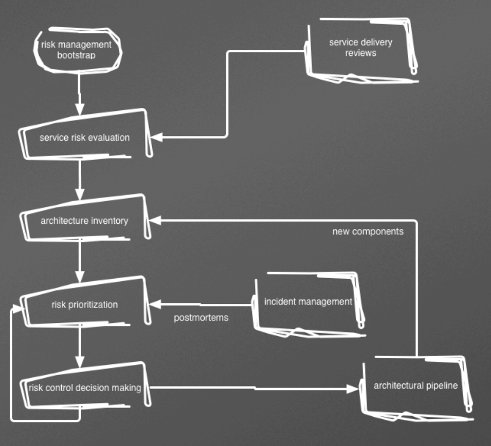
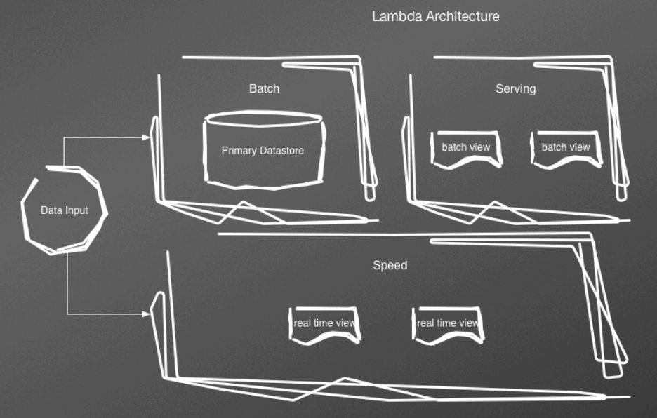
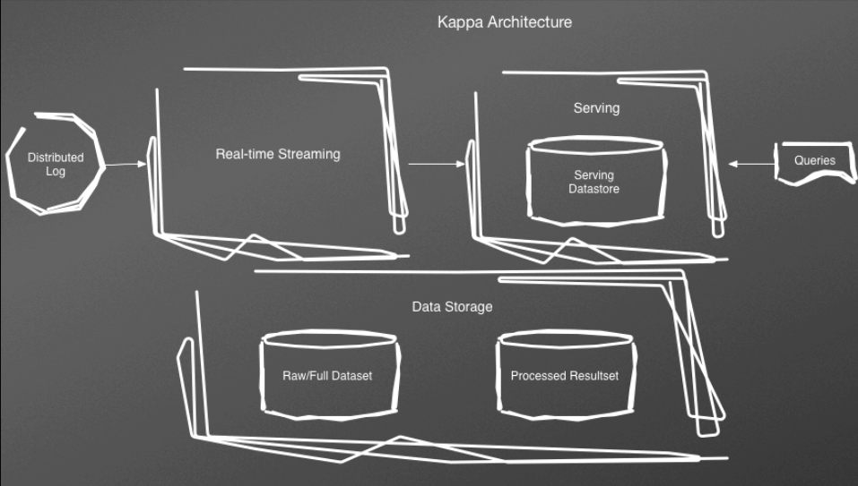

- # Preface
  collapsed:: true
	- this book presents DBRE as the next generation of DB professionals. the DBA was the classic DB professional, and had deep expertise in everything pertaining to DBs. but they were "in the business of crafting silos and snowflakes", siloed away in the DB world.
	- a DBRE is instead a great regular "RE" with a deep domain-specific knowledge of the DB world
- # 1. Introducing Database Reliability Engineering
  collapsed:: true
	- what is reliability engineering?
		- > fundamentally doing work that has historically been done by an operations team, but using engineers with software expertise, and banking on the fact that these engineers are inherently both predisposed to, and have the ability to, substitute automation for human labor.
		  — Ben Treynor, VP Engineering at Google
	- "today's database professionals must be engineers, not administrators". we need to take a devops mindset where nothing is "somebody else's problem", and an engineering mindset where we design and build things with expertise and repeatable processes.
	- **what are the guiding principles of a DBRE?**
		- **protect the data.**
			- have an automated backup and recovery process
			- have a standard security procedure
			- use the right DB for the job, considering DB as you do
			- use redundant storage
			- use automated provisioning and deployment
		- **self-service for scale.**
			- DBREs are rare, so you can't promise to handle everyone's data needs for them! instead, increase your leverage by creating self-service platforms
			- empower and guide others, rather than functioning as a gatekeeper
		- **elimination of toil.**
			- use automation and standardization to eliminate operational busywork (that is repetitive, non-creative, and non-challenging)
			- for example, building an automated rolling schema change utility, rather than a manual deployment process
		- **databases are not special snowflakes.**
			- what's important is the business value. the database isn't any more or less important than any other technical component. ideally, we should be able to survive their outages and replace them at-will, like any other component.
			- [[pets vs. cattle]]: it's caught on for servers, but database tend to be holdouts that we treat as pets
		- **eliminate the barriers between software and operations.**
			- infrastructure, config, data models, scripts... those are all software too! so, DBREs should participate in the software engineering lifecycle the same as and other software engineer.
			- this can't be unidirectional! you can't only demand that ops people learn to code- software people need to learn ops.
			- DBREs might be directly embedded in an engineering team
	- what is operations?
		- > Operations at a macro level is not a role. Operations is the combined sum of all of the skills, knowledge, and values that your company has built up around the practice of shipping and maintaining quality systems and software. It's your implicit values as well as your explicit values, habits, tribal knowledge, and reward systems. Everybody, from tech support to product people to the CEO participates in your operational outcomes.
		  — p. 20
		- many orgs do this super poorly! bad ops culture can become a burnout factory.
		- it's common to think that serverless means you can stop doing ops. that's completely incorrect. in fact, it's a world where application engineers are constantly doing ops, and need to be much better at it than they usually are!
	- **the database heirarchy of needs:** much like humans with [[Maslow's hierarchy of needs]], databases have one too! what would you do on day 1, and in sequence from there? which needs are most fundamental?
		- **survival and safety.** backups, retention, failover. making sure the data is safe and the servers are alive. this is also when you might *start* thinking about scale- but don't scale prematurely
		- **love and belonging.** make your data a first-class citizen. break down technical and cultural silos. educate and empower folks to make changes.
		- **esteem.** observability, debuggability, introspection, instrumentation. your DB should tell you when there are problems, rather than relying on dashboard gazing. have just enough graphs, not so many that the signal gets hidden by the noise. have knobs to selectively degrade service instead of falling over.
		- **self-actualization.** this is unique for each org! you have the right data infrastructure to get you to where we need to go.
- # 2. Service-Level Management
  collapsed:: true
	- when we design and build a service, we need a set of requirements about what it does. that's an [[SLA]]. within the SLA, the [[SLO]]s are commitments by the architects and engineers that guide the design and operation of the system.
	- SLOs are hard! finding the right things to measure and ways to measure them is non-obvious. examples:
		- if I am calculating the % of successfully served API requests... measured by who? the API? (what if the load balancers are down? or a database is unavailable?)
		- which services do we measure? would we rather have 99.95% availability for the API and 97% for out batch processor, or 99% for both?
		- what if you count error percentages? well, which errors are due to system failures, and which due to malformed user input?
		- what if failures are not evenly distributed? for example, 95% of users have great availability but 5% only 30-50%.
		- what if your availability is great, but the latency is so bad the service is practically unusable?
		- what if availability is low for some users because of factors beyond your control? (like their network infra?)
	- what indicators might be useful to consider?
		- **[[latency]]:** how long does it take for a request to receive a response?
		- **[[availability]]:** what percentage of the time is the system able to return responses?
		- **[[throughput]]:** how many successful responses happen in a given unit of time?
		- **[[durability]]:** how much data is successfully persisted, rather than lost?
		- **[[cost]]** or **[[efficiency]]**
	- defining SLOs:
		- you should build your SLOs from the same set of requirements that product features are built. stay user-focused!
		- probably, you only want ~3 or so. more than that, and there's a high chance you're measuring symptoms rather than the thing you really care about
		- SLOs are an iterative process. don't expect to get it right on the first try. once they're right, don't expect the system to remain the same over time!
	- **latency SLOs** could be expressed like: "request latency must be less than 100ms". we might not want to leave the lower bound undefined, though! it might be that 5ms latency is much faster than any client can actually process. so we might say, "between 25ms and 100ms"
		- you need to think about latency as a [[distribution]]. and it's basically never [[Gaussian]]. so summary stats like [[standard deviation]], [[median]], etc. aren't going to be informative
			- you might need to use averages _to visualize_, but make sure you store the actual measurements. averaging is lossy.
		- to get a sense of the effect of outliers, you might instead use [[percentiles]] like P95, P99, etc. percentiles are a great fit because we know there will always be outliers. we must choose how many outliers we're willing to tolerate, and measure it.
	- **availability SLOs** will typically be expressed in 9's. "five 9's" = 99.999%, etc. we can use these %s to figure out how much downtime is allowed each year. consider each extra 9 a new level of engineering complexity and difficulty.
		- you might also consider measuring [[mean time between failures]] and [[mean time to recover]]
		- in increasing availability, we can't focus on eliminating failures! we need to look at [[resilience]] over [[robustness]]. we instead emphasize:
			- low MTTR, so the system gets back up fast. (we can do this with automated recovery proccesses.)
			- low impact during failures. (we can do this with distributed and redundant envs.)
			- treating failure as a normal event in the system, and making sure remdiation (whether manual or automatic) is an integrated part of everyday life
		- scope your availability SLOs! over what time period do we measure? what's the maximum incident duration we'll tolerate? what's the maximum % of affected users? etc.
		- knowing how much downtime we allow allows us to also treat it as an investment. if 10 minutes per week is OK, we know we _can_ lock tables to generate an index for 10 minutes if we need to.
	- **throughput SLOs** should be something like the maximum value the service can support while maintaining the other SLOs.
		- you need these because a system that's highly available and low-latency won't necessarily have great throughput! there can be bottlenecks that wreck throughput without tipping over your system
	- **cost SLOs** have to be driven by business value, so there's no one-size-fits-all here. probably pick the action that generates the most value.
	- **how to monitor and report on SLOs?**
		- let's start with **availability**. at first, low-level metrics like host uptime etc. may seem useful. but in a massively distributed environment, low-level measures stop working. how do you do this for 1000 hosts?
		- instead, start at the broadest level- error rates from real user requests with [[real user monitoring]] (RUM).
		- make sure to store this data as raw as possible. averages are lossy! you should probably slurp your server logs through syslog into some [[time-series database]]
		- it's useful to not just see when we've broken the SLO, but also predict whether we will in the near future. we might do that by comparing our current week to previous weeks, using a decaying function to ensure that more recent (and more similar) weeks get more weight.
		- [[synthetic monitoring]] is useful too! we can create automated coverage to ensure that everything we want to be tested, is tested, even if users aren't active on those code paths at that time.
		- on to **latency**. we can use the same log data we stored when we were tracking availability, and use that to calculate latency.
		- on to **throughput.** again, we'll already have the data we need.
			- but this is tricky, because your system may organically have traffic below your minimum. so you may need to think about periodic [[load tests]] to ensure it's good.
		- on to **cost.** this can be tricky to measure, because some costs are not easily quantifiable. if you're using a cloud service, there's probably a cost tracking system you can use. but if you're on bare metal, you'll need to estimate a lot of stuff yourself. cost data may also not be very granular.
			- think also of the cost of the staff who maintain the service.
	- why do SLOs matter?
		- > We cannot emphasize enough that **all actions must be a result of planning to avoid violations of our SLOs.** The SLOs create the rules of the game that we are playing. We use the SLOs to decide what risks we can take, what architectural choices to make, and how to design the processes needed to support those architectures.
		  — p.49
	- q's:
		- the authors suggest we can't focus on robustness, only resilience. what do you think about that?
		- should _all_ actions be a result of avoiding SLO violations? does this doom us to fover being reactive?
- # 3. Risk Management #[[risk management]]
  collapsed:: true
	- [[risk management]] is what we do to identify the [[risk]]s possible and reduce their likelihood.
		- we can't eliminate all risk! we need to prioritize and iterate.
		- we might use a process like this:
			- identify possible threats
			  logseq.order-list-type:: number
			- assess the likelihood and impact of each risk
			  logseq.order-list-type:: number
			- categorize the likelihood and outcome
			  logseq.order-list-type:: number
			- identify controls to mitigate impact or reduce likelihood
			  logseq.order-list-type:: number
			- prioritize risks
			  logseq.order-list-type:: number
			- implement and monitor controls
			  logseq.order-list-type:: number
			- repeat!
			  logseq.order-list-type:: number
	- what might affect the quality of the risk assessment?
		- **unknown factors and complexity.** the more complicated a process is, the more room for uncertainty
		- **availability of resources.** in a scrappy startup environment, you won't be able to get the resources you need for a thorough ongoing process! try to generate value with what time and resources you _can_ get
		- **human factors.** there are many ways individual human actions can make things go south: inaction, ignoring the familiar, fear, overoptimism...
		- **group factors.** similarly, at the group level: polarization, risk transfer, decision transfer...
	- what *not* to do:
		- don't allow subjective biases to damage the process
		- don't rely on anecdotes and word of mouth
		- don't focus only on the past
		- don't stagnate
		- don't ignore the human
		- don't ignore evolving architectures and workflows
		- don't assume that the current environment is the same as the past
		- don't create brittle controls or ignore worst cases
	- how to get a process working:
		- start with an initial **bootstrap**. your goal is to identify the biggest risks to the system's SLO, most likely risks, or hazards that would destroy long-term viability. don't try to be comprehensive, just get a starting list going.
		- then, do a **service risk inventory**. sit down with the product owners and evaluate the risk tolerance. what SLOs are defined? what costs from outages are acceptable? what does downtime look like? can downtime undermine the whole company?
		- next, do an **architecture inventory**. list all the systems and environments that we're responsible for. be detailed- include jobs, roles within components, comms pathways...
		- next, **prioritize** the risks, assessing failure for each component of your inventory. you can use a risk assessment matrix. be as quantitative as you can with your values!
		- finally, it's time for **control and decision making**. find technique to mitigate or avoid the highest-priority risks. there are three approaches: avoidance (eliminate the likelihood), reduction (reduce the impact when it happens), or acceptance (decide it's OK and plan for it).
	- once you have your process bootstrapped and ongoing, you'll add:
		- **service delivery reviews**, in which you'll reflect on any changes in the service that would impact the risk.
		- **incident management**, in which you'll learn from real incidents and update your process accordingly
		- an **architectural pipeline**, where new system components will be brought through the risk management process.
	- 
- # 4. Operational Visibility #observability
  collapsed:: true
	- we need to have visibility into our database service in order to do DBRE! why?
		- break/fix: we need to know when stuff breaks so we can fix it!
		- performance: how well does this actually run?
		- capacity planning: how much load are we under?
		- debugging: why did things go wrong?
		- business analysis: how is the service actually being used?
		- correlation and causation: what is connected to what?
	- [[human error]] is never a [[root cause]]. it's always due to underlying system or environment failures. for example, overworking an employee without rest leads to mistakes. or, an overly complex control plane leads to mistakes. also, "root cause" itself is misleading- there's rarely one single issue at the start.
		- see also [[no view of human error]]
	- how does traditional monitoring work?
		- hosts are servers, long-running stable instances
		- there's a focus on systems, not services
		- monitoring focuses on utilization and thresholds (symptoms) rather than customer-facing metrics (SLIs)
		- architecture is siloed, and each silo is monitored separately
		- low granularity
		- focus on collection, not analysis
		- high admin overhead
	- nowadays, visibility is very different! data stores are massively distributed, analysis is critical, and we care primarily about user impact. what's that mean for us?
		- we need to treat our OpViz systems like BI systems. don't farm it off to some separate ops team! treat it like you would a data warehouse or big data platform.
			- a mature OpViz platform can provide not only the state of the infrastructure, but also the state of the application running on the infrastructure
		- assume that distributed and ephemeral environments are the norm.
		- we need to store high resolution data. use the timespan at which the metric has enough variability to affect your SLOs to determine what's high-res enough! stuff like CPU usage or DB connection queues probably need subsecond metrics. disk space might not.
		- keep the architecture simple! in a distributed environment, there is too much that we could measure! keep signal-to-noise ratio good by only letting in data that's meaningful.
			- focus on metrics directly related to SLOs. latency, availability, call rates, utilization...
			- you'll also want to standardize the knobs available to engineers, to make it easy to understand.
	- ## inputs
		- to create good outputs, we require good inputs. try to use data already generated by your environments (whitebox monitoring), not artificial data (blackbox monitoring). you might use [[observability]] tooling for this, like [[Honeycomb]], to trace a user flow through the whole architecture.
		- allowing services to send their own monitoring data, rather than pulling it via a monolithic central service, helps you scale
		- when there's too much data for humans to make sense of, you might need some sort of automated anomaly detection system to find weird patterns that need attention. YMMV!
		- stuff you might send in:
			- **metrics**, such as counters, gauges, histograms, or summaries. these are numeric data to which you can apply functions like count, sum, mean, median, or percentile
			- **events**, discrete actions from your environment
			- **logs**, data and context created by an event
	- ## outputs
		- **alerts**: an interrupt that tells a human something's wrong and a response is needed
		- **tickets**: a scheduled piece of work for engineers to address later
		- **notifications:** recording that some event occurred
		- **automation:** drive responses to situations without human involvement
		- **visualization:** graphs and dashboards
	- think of your data as a stream from clients to DBs and back. a DB exists to take in, hold, and serve back data. so, _everything_ we might want to measure can boil down to:
		- how long does it take to get data in?
		- how long does it take to get data out?
		- is the data safely stored? how?
		- is the data available in redundant locations?
	- how do we bootstrap a system like this?
		- we start with zero. there are no metrics by default. furthermore, starting to build an elaborate OpViz platform on day one would be a waste! build it once you actually need it.
		- we might follow a progression in levels of sophistication like so:
			- monitor if the DB is up or down
			  logseq.order-list-type:: number
			- monitor overall latency, errors, and E2E health metrics
			  logseq.order-list-type:: number
			- instrument the application to get latency & errors for every DB call
			  logseq.order-list-type:: number
			- gather as many metrics as possible about the system as possible
			  logseq.order-list-type:: number
			- create specific checks for known problems
			  logseq.order-list-type:: number
	- once bootstrapped, how do we evolve it? key questions to ask yourself:
		- **is my data safe?** it should be stored in at least 3 live copies if it's mission critical.
			- but not all data is mission critical! some stuff is fine to lose, like data that can be reconstructed from logs. still store these in n+1 copies, though
			- you also need backups, with regular verification that the backups actually worked
			- you might do:
				- three nodes up?
				- replications running?
				- replication <1 second behind?
				- most recent backup?
				- most recent restore from backup?
		- **is the service up?** you need an E2E health check that lets you know if the system's up.
			- there should be a thorough top-level check, that tests all DB connections in the critical path.
			- there should also be a simpler liveness check for things like load balancers to use. (if they use an overly-complex check, they might cause system load just from checks!)
			- have at least some off-premises checks, like a check that your monitoring system is working
			- you might do:
				- app-level health check
				- query against each partition in each datastore
				- capacity monitoring- disk space, DB connections
				- error log scraping- DB restarts, corruption
		- **are my customers in pain?** there are infinite ways your system might break, and you can probably only guess a few % in advance. so, set up the basics, then *go do something else*, and return when you've seen how the system actually breaks and gathered real data to work with.
	- concretely, how should we instrument?
		- start by instrumenting the application. the leading indicators of problems will be changes in user and app behavior.
			- measuring and log all req/res to pages and endpoints
			- do the same to all external services- DBs, caches, search indices
			- do the same to any independent jobs or workflows
			- do the same to any independent, reusable code that touches the DB
			- monitor how many DB calls are executed for each page/endpoint/method
			- you can potentially use [[SQL]] comments to add information about where a chunk of SQL was called from in the codebase.
			- you'll want distributed tracing. it should be possible to determine which bits of SQL are tied to which bits of code are tied to which user actions. otherwise, you'll waste weeks just shuffling data around. ideally, you want to be using shared tools with SWEs, so they can learn!
			- all events and logs need to be stored. include events like code deploys!
		- next, instrument the server or instance. collect data regarding the OS's and physical resources behind our datastores. use the [[USE method]]- underutilized, saturated, or erroring. be thorough and measure just about everything about your hardware and OS that you can.
			- also, send all events and logs
			- in a cloud environment, you may need to measure **cost** and **steal time** as well
		- next, instrument the datastore. again, use the USE method. cover each of the connection layer, the internals, the DB objects, queries, and asserts/error events! the goal is to understand any bottlenecks that could cause problems.
			- internal things you might measure: latency/throughput, commits/redo/journaling, replication, memory structures, locking/concurrency
			- know how much storage each DB object takes
- # 5. Infrastructure Engineering #infrastructure
  collapsed:: true
	- databases always run as processes on some host. could be a physical server, a virtual server, a container, even some abstracted service.
	- physical servers are hosts that have OSes and are 100% dedicated to running processes from that OS
		- in an immature environment, all services might be run from one host! a DBRE's first task then will probably be to get a dedicated host for the DB
		- you should have a gold-standard kernel and OS configuration, that automatically deploys with your hosts.
		- topics to address: [[IO scheduling]], [[memory allocation]] and [[fragmentation]], [[swap]], NUMA, network, storage...
		- discusses [[jemalloc]]/[[tcmalloc]], [[THP]]
		- [[linux]] isn't _particularly_ well optimized for low latency/high concurrency data needs. the best you can do is often to make sure you never fully use all your physical memory
		- an old point of view is that a slow database is better than a down database, so swapping is fine. a newer, DBRE-style view is that latency impacts are as bad as any other, so swapping shouldn't be tolerated. only disable swap if you have a super solid failover process, though!
		- benefits: physical servers are in a sense the _simplest_ way to host a DB- there are no abstractions in between you and the DB, and your control is complete.
		- drawbacks: wasted capacity, long deploy times, and difficulty ensuring identifcal configuration
	- a virtualized approach is another option. [[virtualization]] lets us use software to create dedicated resources from dividing up the hardware. like [[vm]]s.
		- a [[hypervisor]] creates and runs the VMs
		- databases within one hypervisor have less potential for concurrency. focus on horizontal scaling across nodes, not vertical scaling within nodes
		- storage performance is slower, and you generally can't guarantee your writes are flushed to disk if there's a crash!
		- two options for storage: local VM storage, which is ephemeral, and persistent [[block storage]]. you probably want the block storage. but it's more network-dependent than a traditional disk!
		- benefits: rapid deployment, self-service platforms
		- drawbacks: less durability (data loss almost inevitable), instance instability (so you need to invest in failover and recovery), requires horizontal scale (so you need to automate many instances), latency may be more unstable
	- [[container]]s are another approach. they are lighter than VMs. they sit on a physical host and share its kernel, binary, and libraries.
		- benefits: they can be much faster to start than VMs. good for quick prototypes
		- drawbacks: they are less customizable- no kernel-level tweaks. bad at IO-heavy workloads like DBs.
	- [[DBaaS]] is another approach. a cloud provider manages a database for you.
		- DBaaS is often sold as a way to get rid of the need for DBA/DBRE specialist skillsets. this isn't quite true. you eliminate a lot of the easier problems and toil, but you run the risk of getting yourself into the _hard_ problems earlier.
		- early choices like DB version etc. should be made by someone with depth in the DB ecosystem
		- benefits: service provider handles deployments, failover, upgrades, backup. may have good metrics integration with the rest of cloud platform. may have proprietary high-perf "special sauce"
		- drawbacks: lack of visibility- you have no access to the underlying OS or hardware. can't use tools like [[top]], [[dtrace]], [[vmstat]]. implementation is a black box where you rely on your vendor to get it right.
- # 6. Infrastructure Management #infrastructure
  collapsed:: true
	- we no longer live in the days where a deployment environment is one or two boxes we can manually configure. we have to support many more machines than we have pairs of hands.
	- to accomplish this, automation is required. we can't have stability without it. our goals are to eliminative any repetitive or manual processes, and to create [[reproducible]] standardized infrastructure.
	- what to cover?
		- software installations, including OS and DB
		- software configuration
		- bootstrapping data
		- installing peripheral tooling: monitoring tools, backup utilities, operator toolkits
		- testing the infra for correctness
		- compliance testing
	- the first thing we need is [[version control]] for all components. not just source code! we need [[configuration as code]]. libraries and packages, config files, OS versions, helper scripts... all should be under version control.
	- you will probably need a configuration mananagement system. something like [[Chef]], [[Puppet]], or [[Ansible]]. these systems are [[declarative]]- you *define* your config rather than scripting it.
		- these systems have primitives- "recipes" in Chef, "manifests" in Puppet
		- these primitives are rolled up into "cookbooks" or "playbooks". they can be used to configure different environments (test vs. dev. vs. prod), provide overridable defaults, etc.
		- we want the actions of these systems to be [[idempotent]]. running the system should semantically mean "take the system in its current state, and bring it to the target state".
	- once you've got all your config defined, you need to actually build your DB. there are two approaches:
		- **frying** means dynamic configuration at host deployment time. provision the hosts, deploy the OS, then configure. all the configuration management systems mentioned can do this.
		- **baking** means configuring a base image at build time. you get a snapshotted "golden image", like an AMI or VM image, that you can deploy in the future. [[Packer]] is a tool that can do this.
	- once you've built the DB, you need to ensure it remains configured correctly over time. [[configuration drift]] is a real threat. systems that were configured the same on deployment, may end up in different states as folks log in and tweak it over time.
		- consider [[immutability]]. if you forbid the infra from changing after initial configuration, drift won't happen. all changes will have to occur via changes to the version-controlled definitions and deployed through the standard pipeline. benefits of immutability: simplicity, predictability, recoverability
		- but immutability has a lot of overhead. especially for frequently-tweaked parameters on a arge cluster.
		- use tooling to help. most of the config management tools mentioned can do synchronizations. there's also tooling to identify differences and trigger redeploys.
	- you won't have just one DB instance, you'll have many. so you'll need tools to orchestrate.
		- you might have a monolithic infrastructure definition, in which everything for every part of your app lives in one big definition. there are lots of downsides. tests are slow and fragile due to testing against the entire definition. changes are prone to break _everything_, not just one part. it's hard to build small subsections of the app without building the whole thing. and big changes tend to be limited to developers who grok the whole stack, causing bottlenecks.
		- you can improve by separating definitions vertically, one definition per service. this will be challenging if you have multiple services sharing a database tier- you'll need a separate definition for that tier.
		- you can improve further by separating definitions horizontally, one definition per tier. break out your web server stack, application server stack, and DB stack. you've now reduced your failure domain even further.
		- [[Terraform]] can be used for this stuff
	- you should test your infrastructure images! this brings the benefits of [[TDD]] to infra. you can use something like [[ServerSpec]] for this.
	- in a distributed environment with decoupled, dynamic components, you have all kinds of new complexities, and need things like a service catalog to do [[service discovery]]. tools like [[Apache ZooKeeper]] or [[Consul]] can help you with this. you might need this in the DB world for stuff like failovers, sharding, and boostrap nodes.
	- you are going to want to test changes in a local development environment before committing them to prod! try to make the local sandbox as close to prod as possible- same OS, same config and orchestration tools, etc. [[Packer]] and [[Vagrant]] can help you here.
- # 7. Backup and Recovery
  collapsed:: true
	- data is your most precious commodity. now that you know how to store it, how do we keep ourselves from losing it?
	- **physical** vs. **logical** backups:
		- a physical backup backs up the actual files used by the database
		- a logical backup exports the data to some other portable format. for example, the replication log
	- **offline** vs. **online** backups:
		- an offline backup is made while the system is shut down
		- an online backup is made during live operation. this adds extra complexity because the data will be changing as you copy it! you'll need a way to snapshot a specific point in time.
	- **full**, **differential**, and **incremental** backups
		- a full backup copies everything
		- a differential backup only copies what changed since the last full backup. recovering will mean restoring 2 backups (last full, and this one)
		- an incremental backup copies what changes since the last backup of any kind, full or incremental. recovery means restoring $n$ arbitrary backups
	- things to consider about your backup strategy:
		- is it fast enough to meet your uptime constraints?
		- is it frequent enough that you meet your durability constraints?
		- how do you integrate the backup with other systems, like a message queue, which may be eventually-consistent?
		- how do you handle forward and back compat? what happens when the software that uses the data store updates?
	- types of recovery:
		- planned recovery. things like building a new node or cluster, performing a routine ETL process, preparing for a test in a test environment, etc.
			- plug this into your observability stack! it will give you useful info about capacity issues that makes sure you don't accidentally exceed what your recovery process can support
		- unplanned recovery. things like user or application errors, OS errors, or hardware failures.
			- think about the scope of failure events. are they isolated to a single node? cluster-wide? datacenter-wide? these will require different strategies
			- also think of the scope of affected data. is it a single record? multiple records? the DB metadata?
			- also consider how your SLOs will be impacted
	- what pieces does a recovery strategy need?
		- **detection.** you must know about data loss or corruption as soon as possible.
			- one valuable way to do this is to disallow running arbitrary scripts in prod. instead, provide a wrapper or API that's well-tested and comprehensively logged. this introduce guardrails to reduce failure, _and_ monitoring to see the failure quickly if it happens
			- rely on monitoring of logs and metrics to catch OS or hardware failures
		- **tiered storage.** not every part of your recovery strategy should live in the same data stores!
			- you'll want online, high-performance storage for your production workloads. things like replacing failed nodes, adding new ones, or standing up test environments. you can probably only afford to keep a few days at this tier.
			- online, low-performance storage might be used for infrequent or long-running processes that aren't sensitive to latency. things like dealing with user errors or corruption repair. you can probably afford a month or more at this tier.
			- offline storage, like [[AWS/Glacier]], is cost effective for storing massive amounts of data in the long term, though drastically slower to access. you might use this for compliance or business continuity. you can probably afford to store years of this.
			- object storage, like [[AWS/S3]], lets you store unstructured data with high availability, API access, versioning, etc.
		- **a varied toolbox.** you shouldn't put all your recovery eggs in one basket.
			- replication isn't a backup strategy!!!
			- take full and incremental, physical and logical backups. full physical is for building out new nodes for capacity or replacing failed ones. incremental physical is for bridging the gaps between expensive full backups. logical backups are useful for forensics and moving data between nodes
		- **testing.** your recovery is useless if it is broken, so you need to test it to ensure it works.
			- you can do this by adding recovery into everyday processes, or by adding a separate continuous testing process
- # 8. Release Management #release
  collapsed:: true
	- how can DBREs support fast, efficient software release? how can we protect our data and datastores without becoming a bottleneck?
	- **education and collaboration**
		- the better the choices the software engineers make about their data, the less intervention is needed from a DBRE. so, educate teams in your day-to-day interactions and provide them with self-serve resources.
		- make the education effort measurable. consider measuring things like:
			- number of database-related tickets that require DBRE intervention
			- success rate of deployments for db-related tickets
			- feature velocity
			- downtime from db changes
		- become a funnel for useful information. you'll encounter lots of specialty information that general engineers won't know. feed them the best bits.
		- foster active conversation. try things like brown bag lunches, AMA chats, tech talks, or dedicated chat channels
		- make your domain-specific knowledge about system architecture and data models legible via docs and standardized tools
	- **integration**
		- the more often changes are integrated, the faster we catch errors, and the quicker feedback loops are. make sure any change to the db triggers a fresh build, integration, and tests. but [[continuous integration]] at the database level is uniquely challenging!
		- you need a version control system, with _everything_ checked in. you need automated builds. you need realistic test data, including large datasets for load testing. you need a migration system. and you need a CI system.
	- **testing**
		- encourage abstraction and encapsulation to make it easy to test application components as black boxes, focusing on just the parts that actually touch the data
		- do post-commit testing that checks whether the changes applied and the app's still up
		- do pre-build tests for things like SQL errors, static analysis, etc.
		- the build itself is a sort of test- if it fails, something was wrong!
		- do a full dataset test to ensure the system still functions under load. look for things like latency and resource utilization.
		- do downstream tests of things like event workflows and ETL jobs
		- do operational tests of things like backup and recovery processes, failover, security, etc.
	- **deployment**
		- ideally, software engineers should be able to know which changes require DBRE help and which don't. they should also have the tools and expertise to own most changes themselves. and it should be possible to deploy those changes at any time.
		- use versioned migrations for all changes. consider performance implications of the changes, possible data integrity issues, etc.
		- you can potentially use rules-based analysis to flag which changes are "safe" and which need more attention. for example, changes that impact more than a certain number of rows, certain datatypes like BLOBs, operations on sensitive tables. these guardrails can help SWEs feel confident about db changes
		- sometimes, you can use application code to avoid a large locking update. for example, instead of creating a new column and filling it in a batch, creating it empty, then having the app update each row only when the data is accessed
		- you should have one canonical migration process, not a two-track system (with one for safe changes and one for risky ones). otherwise, the less-used path will be underpracticed and undertested
		- you may need to do [[rolling upgrade]]s, in which you incrementally deploy a change one node at a time
		- you should test your rollback process! one way to do this is, for each change, first apply it and test, then roll it back and test, then apply it again and test.
		- you don't need to rush toward perfect automation.
- # 9. Security #security
  collapsed:: true
	- what's the purpose of security?
		- protecting data from theft
		- protecting data from purposeful damage, either from hackers or internal sabotage
		- protecting from _accidental_ damage
		- protecting private data from public exposure
		- compliance and auditing
	- how do we do database security?
		- the DBRE needs to be a cross-functional role. more of an SME and liaison than a team that executes on security projects.
		- security needs to be intergrated into engineers' daily practices, not a separate checkbox on a compliance sheet
	- start with **education**
		- lead conversations, build domain-specific knowledge bases, and collaborate with pairing and review
		- teach about:
			- securing database controls and access
			- effective use of encryption and other security features
			- what data might make it out of the DB and into other systems (logs, telemetry, etc.)
			- DB-specific vulnerabilities, CVE remediations, etc.
	- move to **self-service**
		- you can't review every PR and contribute to every project spec. instead, partner with InfoSec experts to create approved and reusable security patterns that engineering teams can adopt
		- this ties into Chapter 5 on infrastructure engineering! you can bake these approved patterns into your gold releases of the datastores.
		- consider:
			- approved build numbers/hashes
			- removal of default accounts & passwords
			- locking down unnecessary ports
			- reducing points of entry with constrained access lists
			- removing unneeded feature and config that could allow exploits
			- setting up keys for [[SSL]]
			- scripts to enforce password policies
			- making it auditable so you can see any tampering
	- think about **intergration and testing**
		- test for SQL injection, test the auth layer for common security flaws, and test your stored procedures for things like buffer overflows
		- run these tests automatically!
	- think about **operational visibility**. instrument both the DB layer and OS layer comprehensively. then, if anything gets exploited, you can see what happened.
	- how do we deal with vulnerabilities and exploits?
		- STRIDE can be used to classify exploits: Spoofing, Tampering with data, Repudiation, Information disclosure, Denial of service, Elevation of privilege
		- DREAD can be used for [[risk management]] and prioritizng response: Damage potential, Reproducibility, Exploitability, Affected users, Discoverability
	- basic precautions we can take include stripping unnecessary surface area, keeping the DB patched and up to date, removing unnecessary users, and locking down network and host access
	- [[Denial-of-Service]] makes an application inaccessible by overwhelming it with requests. typically doesn't steal or damage data. (but might be used as cover for another effort that does)
		- remediation is similar to the techniques we use for handling scale and load, like killing problem queries, client-side throttling, or degrading results.
	- [[SQL injection]] injects database code into the application through an unintended channel, like a frontend input. this executes malicious code inside the DB.
		- mitigation involves things like [[prepared statements]] and input validation.
	- data encryption is possible at three different layers:
		- in transit. connections need to be encrypted, and you need to choose a good [[cipher quite]]. consider both communication without your network and outside your network. typically this is implemented at the network level. a VPN might be needed if communicating from outside.
			- use SSL when connecting!
			- store your secrets securely, with something like [[AWS/KMS]], or Hashcorp [[Vault]]
		- at rest (within the DB client), aka "data in use". here we need to allow using the data for all those who _should_ access it, while forbidding it for those who shouldn't
			- you can encrypting at the application level, so that the DB itself doesn't need to be involved
			- you can use an encryption plugin
			- encryption might mess up your performance by wrecking your indices. you can maybe fix that by adding an [[HMAC]], but that in turn reveals info about cardinality etc. to an attacker
		- at rest (on the filesystem). encrypt your logs and such!
			- you can again encrypt before storing
			- or, use an encrypted FS or block-level encryption tool
			- you can also adopt storage devices with encryption built-in
	- data to be concerned about: financial data, health data, PII, military or gov't data, business secrets
	- use defense-in-depth. don't put all your eggs in one security basket.
	- recognize you can't test everything. focus on high risk and easy exploitability first.
- # 10. Data Storage, Indexing, and Replication
  collapsed:: true
	- how do datastores actually store data? everything until now has danced around that. time to dive in.
	- traditionally, datastores use a combination of **tables** and **indexes**. the table is the main storage mechanism, and the index is and optimized subset of ordered data used to improve performance of access
	- how do [[relational DB]]s work?
		- data is stored in **blocks** or **pages** that correspond to a certain amount of space on disk. they're the smallest increment of space that can be read and written.
		- you don't want your DB block size to be smaller than your OS block size! otherwise, you'll waste cycles on every I/O operation that touches several pages.
		- a block also requires metadata, describing what's in there
		- blocks may be organized into a larger data structure called an **extent**
		- most databases store their data in a [[B-tree]], a tree that keeps itself balanced and its data sorted by key. the primary key of a table will be what the main b-tree sorts by. secondary indices won't store the whole data, only the indexed data.
		- writing to a B-tree requires finding the node via search. if that node is full, a split has to occur.
		- greenfield DBs have primarily sequential reads and writes. as the B-tree evolves over time, splits will make it more and more random. performance will drop. this is why you ought to test with realistic data.
		- you ought to tune your block size for good performance. that can depend on what sort of disk you use. for example, SSDs may work better with smaller block sizes.
	- another storage option is the **append-only log**. an [[SSTable]] (sorted-string table) is this. this is what [[Bigtable]] and [[Apache Cassandra]] use.
		- data is stored in files of sorted key/value pairs
		- one implementation is an [[LSM-tree]], in which there are two data structures: a fast in-memory one, then a slower on-disk one that it periodically flushes to. once data is stored on disk, it is immutable.
		- a db might use a [[Bloom filter]] to identify which file a key exists in quickly
	- what other techniques are used for indexing?
		- hash indices, using a [[hash function]]. a [[hash map]] is a simple data structure that uses this technique
		- bitmap indices, storing the index as bit arrays. these can be nice on high-cardinality data
	- how do we handle [[replication]]?
		- in a **single-leader** model, all writes go to one node, and are replicated from there. reads can come from any node. this is simpler than other options. it also guarantees write consistency
			- you can replicate synchronously (optimized for durability), asynchronously (optimized for latency), or semi-synchronously (a compromise)
			- replication requires a replication log. one way to do this is statement-based replication. here, each SQL statement that needs to be executed is run on each follower. this is highly portable, uses little bandwidth, and is easy to audit. but if it involves complex calculations, it can take much longer than simply updating the records. also, SQL can be nondeterministic!
			- using a [[write-ahead log]] is another option. this is commonly used for reliability, but can be used here too. for each transaction, this log will show what bits need to be changed. this is very fast, and deterministic. but it takes a lot more bandwidth and isn't portable.
			- row-based replication is a third option, in which you share a log of change events that shows which changes to apply to each row. (also called logical replication). this is a speed and portability compromise between the previous two.
			- block-level replication, or physical replication, is another. this happens _outside_ the database. this gets us low-latency synchronous replication, but there can't be a running database instance on the follower. so we can't use it for scalability, only for recovery.
			- you should collect data on: replication lag, latency impacts, replica availability, replication consistency, operational processes
			- latency can have different sources! try to measure delay in time from leader to follower (in async rep), network latency, write impact (in sync rep)
		- there are two types of **multi-leader** model, both of which introduce new complexity
			- in a traditional multi-leader model, there's still a leader and follower role, you just have multiple leaders now.
				- in an environment that demands multi-leader rep, you'll find that synchronous replication is not feasible. so you are now going to need to worry about conflicting writes.
				- one way to avoid this is by writing specific subsets of keys to specific nodes.
				- another common option is [[last write wins]], though watch out for the complexity of timestamps in a distributed environment!
				- [[CRDT]]s are a more advanced option
			- in a write-anywhere model, there's no distinction between nodes. writes and reads can go anywhere.
				- you'll have all the challenges of the past approach, and more!
				- you are now living in the world of [[eventual consistency]].
				- you will have to think about read and write quorums, including potentially a [[sloppy quorum]] to allow writes to continue during node downtime
				- you might have anti-entropy mechanisms like a [[Merkle tree]]
- # 11. Datastore Field Guide
  collapsed:: true
	- now that we understand a lot of the theory behind datastores, how can we indentify them and understand relevant factors "in the wild"?
	- what conceptual attributes should we look at?
		- the data model: is it relational? a key-value store? a document store? a graph db?
		- transactions: are they [[ACID]]? [[BASE]]?
	- what internal attributes should we look at?
		- what storage engine is used?
		- where does it fall re: the [[CAP theorem]]?
- # 12. A Data Architecture Sampler #[[software architecture]]
  collapsed:: true
	- now that we've analyzed how individual data stores work, let's look at how they come together in a multisystem architecture
	- components you may have:
		- **frontend datastores**, used directly by the user-facing app for CRUD operations etc. traditionally these are [[OLTP]] databases. it's populated by data from users. the app will not function without it, so it needs to be very fast and high availability
		- a **data access layer** in the application, which provides a simplified way to access the datastores. for example, an [[ORM]]
		- **database proxies**, which sit in between the application and the frontend datastore and route the queries. some might sit on [[OSI Model]] layer 4, which will be low-latency but not very configurable. others at layer 7, which will have more latency but access to fine-grained packet details. these can help with availability and scalability by handling failure better and routing traffic more intelligently under load, but may have some latency and data integrity costs.
		- **event and message systems**, which might be triggered in response to database events. for example, pushing data to downstream analytics, or sending a transaction to fraud review. these can help with availability and scalability by pushing work out of the DB, but with data integrity costs now that it's split across systems. direct DB latency will be lower, but the jobs in event queues will be aynchronous and have _more_ latency
		- **caches and memory stores**, used to speed up data access using in-memory storage. you might take a few approaches to using a cache- one, writing to DB first, then cache. two, writing to both in parallel. three, writing to the cache first, then letting it write to the DB async (write-through)
			- caches can help availability by allowing reads even when a DB is down, but also makes it more complex, since now you need to think about availability _of the cache_. they can also introduce [[thundering herd]] problems. similar with scalability.
			- caches introduce data integrity challenges. they're inherently a static copy of data, so could be stale. if you write to the persistent DB first and then cache, that introduces time when there's stale data. write-through eliminates that possibility, but now you instead need a way to reconstruct the write if the cache crashes before writing to DB
			- caches can significantly improve latency. you might want to think about failing over to direct reads, though, and see if the application can limp along that way.
	- the **lambda architecture** is a common pattern at scale currently, using a batch processing, real-time, and query layer to get both good-enough fast queries _and_ accurate queries on massive data:
		- {:height 328, :width 499}
		- you'd likely use an event system like [[Apache Kafka]] to create a distributed, immutable log to communicate to the layers
		- the batch layer is slow-but-accurate, using something like [[MapReduce]], probably backed by something like [[Apache Hadoop]].
		- the real-time layer is fast-but-inaccurate, using data in realtime as it streams through. think of it as a "delta" that fills in the missing data from the batch layer. once batch processing is complete, it's replaced with the accurate data from there. this is typically built on a streaming data tool like [[Apache Spark]] or [[Apache Storm]], with a low-latency DB like [[Apache Cassandra]]
		- the serving layer sits behind the application and aggregates the data from the other layers, hiding all this complexity behind its interface. it typically uses something like [[Apache Cassandra]]
		- one big problem of this architecture is, you need to maintain two parallel codebases! if your real-time and batch jobs get out of sync, you will have problems.
	- the **kappa architecture** is a newer idea, that uses a distributed log like [[Apache Kafka]] as the datastore:
		- {:height 291, :width 493}
		- this eliminates the batch processing system. instead, we expect the streaming system to handle all that work.
		- we still have an auxiliary store for serving
	- **event sourcing** is a pattern where we save the application's state as a series of change events in an append-only store. then we can "time travel" and reconstruct the state of the system at any given time in the past. ([[Redux]] must have borrowed this idea!)
	- **[[CQRS]]** is a pattern where we split off read queries from write queries at the level of the datastore. different application use cases might wish for different views into your data. we can deliver that! we can use read-optimized data stores for reads, and an append-only log for writes (pairing with event sourcing).
	- the key to each architecture is understanding the lifecycle of the data, and choosing the right components to get it to the right places at the right time. nowadays, almost every organization will ultimately need multiple presentation models while keeping the core data's integrity.
- # 13. Making the Case for DBRE
  collapsed:: true
	- what does a culture that supports database reliability look like? how can we support it?
	- you might want generic good things like blameless postmortems, automating toil, and structured decision-making. but that's not enough on its own.
	- DBREs need to avoid siloing and work at much higher levels of abstraction than before.
	- get involved in the architecture process!
		- help engineers choose the right datastores for their needs. create a checklist that folks can use. write best practices docs.
		- if the org's big enough for a self-service catalog, narrow it down to the best options. maybe provide tiered SLAs for less-common data stores.
		- measure things like:
			- how many arch processes consulted DBREs or used your templates?
			- what storage was used?
			- how many hours of DBRE work were needed per project?
			- the usual availability, throughput, and latency metrics for your approved storage methods
	- get involved in the development process!
		- embed with teams! even if you're not an ace coder, input on features, data modeling, etc. can make a difference.
		- again, provide best practices docs.
		- measure things like:
			- how many pairing hours were there?
			- how many tickets involved a DBRE?
			- break down feature metrics across cases that consulted a DBRE and those that didn't
			- how many on-call shifts involved a DBRE
	- get involved in migrations!
		- don't handle all migrations yourself manually, you'll become a bottleneck.
		- first, incrementally create some heuristics that can identify which changes are safe and which are dangerous.
		- you can also create a database of good migration patterns that engineers can use
		- do post-mortems to ensure the patterns you're promoting really work, and to find the gaps.
		- then, you can start building guardrails around migrations and letting engineers drive the safe ones self-serve
		- measure things like:
			- migration pairing hours
			- how many migrations required a DBRE vs. how many didn't?
			- migration success/failure
	- get involved in infrastructure!
		- use the same code repositories and versioning to store your DB scripts, config files, etc.
		- work with the ops team to configure and deploy datastores using their orchestration tools of choice
		- test as you go, and teach the ops folks as you go
		- measure things like:
			- how many infra components are under config management vs. not?
			- how many infra components are orchestrated vs. not?
			- how many provisions succeed vs. fail?
			- resource consumption metrics
			- how many incidents were managed by non-DBREs?
			- how many escalations from ops to DBREs?
	- use the data you're gather in the above steps to drive future decisions.
	- one of the hardest fights may be around data integrity. it's not often that engineers and product teams feel the need to put time and effort toward db recovery and validation tools. you will likely need to be the champion here.