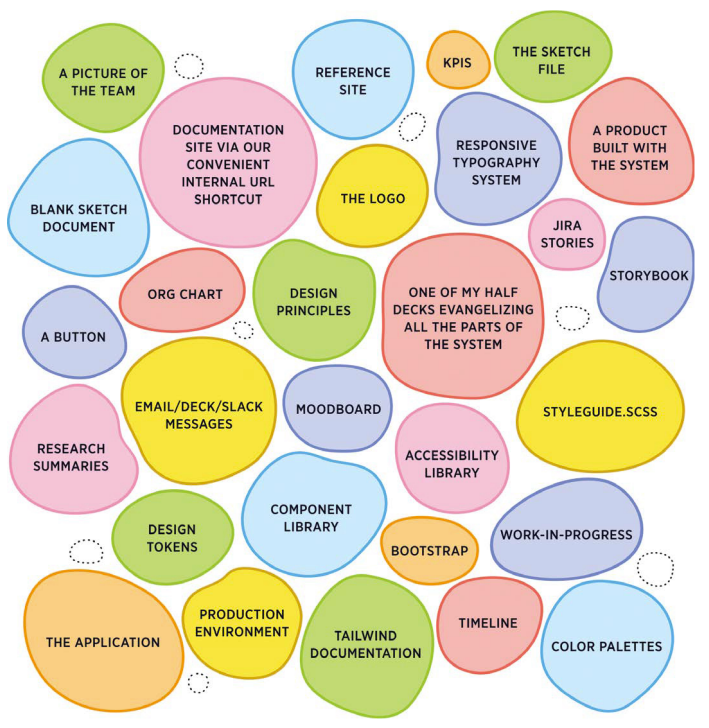
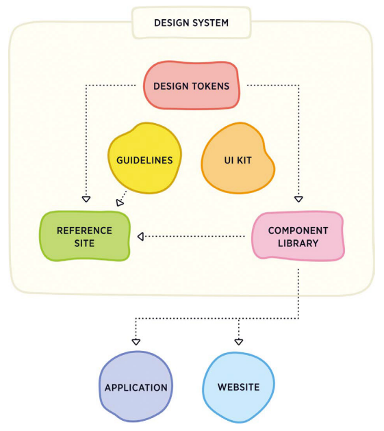
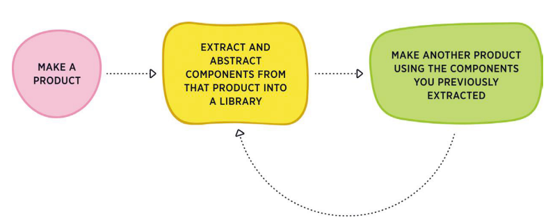
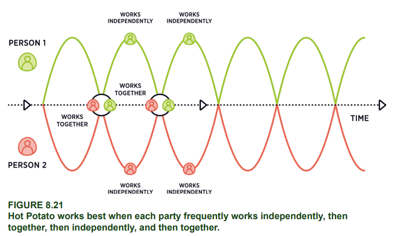

- **Introduction**
  collapsed:: true
	- idea of "design system graveyards"- teams build their own systems, that fail to cross boundaries to other teams, and thus fail
	- we need to move from a design system as a project, to a design system as a product
		- > Most teams approach creating a design system as a project first. They're unprepared for the reality that design system adoption is dependent on changing organizational culture [...]
		- > Quickly, a *design system as a project* that somehow thrives will evolve into a *design system as a product* by necessity. Like any good product, it needs investment, a dedicated team, a roadmap, marketing, and- most importantly- loyal customers and users.
	- the key element is to create a *practice*. but what should that be? #praxis
- **1 - Why Design Systems?**
  collapsed:: true
	- Mall's definition of a design system:
		- > A deisgn system is a connected, package-managed, version-controlled software product that contains the smallest set of components and guidelines a particular organization needs to make digital products consistently, efficiently, and happily.
	- brings up Google's [[Material Design]] as a paradigmatic case
	- more consistent visual language is better for users as well as builders!
	- 4 main benefits:
		- **using a design system advocates efficiency** - don't reinvent the wheel every time you build something new! have proven solutions ready to roll
		- **using a design system generates consistency** - design systems prioritize reusability, and reusability is the main ingredient in consistency
		- **using a design system spawns innovation** - instead of spending all your bandwidth rebuilding the same primitives, spend ono on doing innovative stuff!
		- **using a design system bestows relief** - get back time and space, so your can stress less over your deadlines
	- Hayley Hughes interview
		- > To me, design systems are a community of practice made up of diverse teams within an organization. This practice involves teams collaborating in an ever-evolvig feedback loop of observing, making, and reflecting on what a quality experience means for their users, and how to deliver it.
	- **reflections Q's:**
		- **does your team or organization manage two or more digital products?**
		- **what kind of efficiencies in tools and processing could your organization benefit from?**
		- **do you already have a design system in your organization?**
- **2 - Design System Fundamentals**
  collapsed:: true
	- design systems aren't a tangible, physical thing. they're an ecosystem! like a coral reef
		- {:height 339, :width 317}
		- some takes on what a system is- all of which are correct!
			- > A set of connected patterns and shared practices, coherently organized to
			  serve the purposes of a digital product.
			  —[[Alla Kholmatova]], UX + interaction designer
			- > A design system offers a library of visual style, components, and other
			  concerns documented and released by an individual, team, or community as
			  code and design tools so that adopting products can be more efficient and
			  cohesive.
			  —Nathan Curtis, design system evangelist, EightShapes
			- > A design system [is] the official story of how your organization designs and
			  builds digital interfaces.
			  — [[Brad Frost]] , front-end designer
			- > A design system is any set of decisions governed across an organization.
			  —Hayley Hughes, design director, Nike
			- > The components are the trees. The design system is the forest.
			  —Jeremy Keith, web developer
	- seven common kinds of design systems:
		- **design systems as [[brand]] identities and [[visual languages]] **
			- one of the oldest kinds, predating the concept of design systems!
		- **design systems as projects**
			- systems often start off as a project with a deadline and a specified output. might not even think of it as a system yet!
		- **design systems as tools and templates**
			- a set of artefacts- boilerplate & building blocks to carry over between projects
			- especially useful for freelancers and agencies
			- you might use somebody else's- like HTML Boilerplate or [[Bootstrap]]
		- **design systems as a digital product**
			- the first point where we start really thinking of it as a Design System, capital-D capital-S
			- has a dedicated person or team, gets iterated over time, is never "finished"
			- has a roadmap for near-term or long-term improvement
			- e.g. [[Shopify Polaris]]
		- **design systems as a process**
			- going beyond the tangible and into an approach, a specific shared way of _doing_ design and product
			- e.g. [[design sprints]]
		- **design systems as a service**
			- going beyond a tangible thing _and_ beyond approaches, and into collaborative, interdisciplinary ways of meeting product teams' needs
			- e.g., a group of knowledgeable people that can be brought in for supplementary knowledge, or a [[DesignOps]] org, etc.
			- things get pretty fuzzy here! don't get hung up on the details.
		- **design systems as a practice**
			- practicing is more than doing- it requires active, participatory learning, reflection, questioning, experimentation, attention...
			- > Design systems can be practices, too. Design systems as a practice aren’t about a particular artifact, tool, technology, or process. Instead, they’re about a shared, collaborative effort that can bring the otherwise disparate disciplines of product, design, and engineering together in harmony.
			  Whichever design system—or combination of them—you’re pursuing, you have to do it repeatedly to get good at it. The more you use a tool, the better you utilize it. The more you employ a process, the more familiar it becomes. Design systems that aren’t a practice run the risk of quickly becoming dormant, so make sure you’re setting aside time to practice using whatever kind of design system you choose.
	- **you should pick one type!** if you don't all share a goal, you will work at cross purposes.
	- this book will focus on **product** and **practice** approaches
	- **questions for reflection:**
		- **what kinds of design systems do you have experience with? Which are new to you?**
		- **what kind or combination of design systems does your
		  organization have? Is there a different kind or combination
		  that would work better?**
		- **how can you continue to articulate to your team the kind of
		  design system you’re pursuing so that you’re all working
		  toward the same goal?**
- **3 - The Parts of a Design System Product**
  collapsed:: true
	- much like a modern car shares most of its core functionality with a Model T, most design systems share core similarities
	- 6 most common parts:
		- **a [[UI kit]] **
			- UI kits are useful, but only part of the story. in fact, they might be the _least_ useful part
			- prioritizing UI kits over other components is one of the biggest reasons design systems fail!
				- tools will lead you down the wrong path- e.g. Figma providing tools to do high-fidelity prototyping. when it would have been more productive to just implement in code and iterate
		- **a [[component library]]**
			- the engineering equivalent to a UI kit
		- **guidelines**
			- suggestions or rules on how to use the system
			- this is _not_ the same as the docs website- though the guidelines will likely live there
			- it's great if you can [[JIT]] the guidelines- embed 'em in design tools or dev env
		- **a reference website**
			- here you document your UI kit, component library, and guidelines in one place
			- this is the entry point!
			- it is nice to make it public, if you can. 3 benefits of this:
				- **increases its visibility** - this increases likelihood of use
				- **creates accountability** - demonstrates a commitment to high enough quality to be public
				- **helps recruiting** - show off your sick system and get like-minded hires
			- degrees of openness are possible:
				- **public documentation only**
				- **open-source code library**
				- **open-source documentation**
				- **downloadable**
				- **publish the component library**
		- **[[design tokens]]**
		- **digital products, e.g. websites and applications**
			- the most important part- the live product. without a live product using the system in practice, it's just a useless theoretical exercise
		- {:height 442, :width 377}
	- design systems aren't about their components, as we often think. they're about *connectedness*
		- > “A conglomeration without any particular interconnections or functions [is not a system] … stop dissecting elements and start looking for the interconnections, the relationships that hold the elements together
		  Donella H. Meadows, [[Thinking in Systems]]
		- e.g., using Bootstrap isn't using a design system- you're breaking connections from the original codebase via copy & paste, local modification, etc
	- **questions for reflection:**
		- **do you have a UI kit, a component library, a true design system, or something else at your organization?**
		- **whichever one you have, how did it get that way? (understanding how something came to be may help unlock how to get it to progress.)**
		- **what links or connections are you maintaining between your digital products and your design system?**
		- **how can you move your organization toward a more connected system? if you already have a connected system, how can you deepen the commitment to sustaining a true, connected design system?**
- **4 - The Broken Business of "Buy-In"**
  collapsed:: true
	- there's a common picture of how to kick off a design system, that is **wrong!!**
		- > 1. **Pitch the project.** Propose a design system initiative to executive
		  leadership to get their buy-in in the form of both conceptual
		  blessing and literal funding to grow a team.
		  2. **Create the building blocks.** A small team creates foundational
		  components—“the design system”—that all other product teams
		  are prone to implement and use.
		  3. **Use the system.** Product teams begin using the design system’s
		  components in their product work.
		  4. **Contribute back.** For anything that’s not already in the design
		  system, a product team creates it and then contributes it to the
		  design system for other teams to use.
	- why is it wrong?
		- pitching something that doesn't exist yet and doesn't have a clear benefit is nigh-impossible! easier to get executive buy-in once folks are actively using a system and seeing measurable benefits
		- it's hard to make design decisions in the abstract! we don't actually know what the right decisionsn are til we see 'em in product
			- > When design system work is done in a vacuum and a design system team doesn’t have specific use cases, their strategy seems to be something akin to “let’s provide as many elements as product teams might need at any point,” leading to bloated design systems. In trying to create a design system that gets used by anyone and everyone, they actually create a design system for no one in particular.
		- it's hard to convince people to use new tools! they are giving pu familiarity and autonomy to you. why?
			- you're fighting against the [[principle of least effort]]
		- product teams don't contribute! two main reasons- there's too many things to learn, and it's not their job
	- **questions for reflection:**
		- **do you have buy-in on your design system? If so, how did you
		  get it? if not, how can you get it?**
		- **if the usual business of buy-in is broken, what might be a
		  better way? note your answer now and compare it to what
		  you learn is a better way a few chapters from now.**
- **5 - Pilots - The Best Way to Start and Sustain a Design System**
  collapsed:: true
	- leverage the [[law of inertia]] - objects in motion tend to stay in motion. kicking off your system with a successful pilot will increase the chance it keeps on rolling
	- some natural inflection points to give it a shot:
		- rebranding
		- replatforming
		- re-org
		- content or migration
		- merging with or acquiring another company
	- you don't even have to _call_ it a design system at this stage. just start doing, and justify it on the outcomes
	- use a scorecard to determine sequencing:
		- > **Potential for common components.** Does this pilot have many components that can be reused in other products?
		  **Potential for common patterns.** Does this pilot have many patterns that can be reused in other products?
		  **High-value elements.** Is there a component or pattern with high business value that is the heart of this project?
		  **Technical feasibility.** How simple is a technical implementation of the design system? Is a large refactor required?
		  **Available champion.** Will someone working on this product see it through and celebrate/evangelize using the design system (and even contributing to it)?
		  **Scope.** Is this work accomplishable in our pilot timeframe of [3–4 weeks] (insert your timing here)?
		  **Technical independence.** Is the work decoupled enough from other legacy design and code that there are clear start-and-end points?
		  **Marketing potential.** Will this work excite others to use the design system?
		- if done well, your efforts will go from hard to easier as you move on along the sequence!
	- some different types of pilots:
		- **the Indiana Jones** - extract components into a design system in-place, like Indy snatching the idol and replacing it with a bag of sand. don't change or improve the components, just port. should be unnoticeable to end users
		- **the Facelift** - pair with a rebrand. gives the opportunity for other areas of product to use the new visual language "for free"
		- **the Speed Run** - try to bust out a specific project using the system as quickly as possible
		- **the Surrogate** - if you can't implement it in the product, pretend you are- roll out a faux-product or a currently existing product, but use the system
		- **the Perimeter** - avoid the big flagsihp product areas, and start introducing the system around the edges
	- consider needs vs. wants. you aim to build what the org needs, which might not be what it wants!
	- you can run multiple pilots concurrently. to do this, you want multiple teams operating concurrently.
		- three is a good place to smart- it's the smallest number where patterns emerge. run three pilots. extract stuff once it's used three times. etc.
		- this needs not just three teams, but four- 3 product teams, and a core design system team as the hub
	- you will continually run pilots as you iterate and expand. it's not one-and-done
	- as you run pilots, improve the system as you go! take notes, fix bugs, document your ideas... the system is not a textbook, it's the margin notes
	- pilots are cyclical. [[feedback loops]] are critical. start the loop with product. the Measuring Spoon Cycle:
		- {:height 232, :width 515}
	- think about the difference between *content components* and *display components*. tying a component too close to specific content can stop its productive use with other sorts of content it might work for!
		- > As general guidelines, don’t let your display components describe the content within and don’t let your content components suggest anything about their presentation.
	- how can you do pilots in a mature og with lots of products?
		- **collect best practices** - do an interface inventory. look for both the good and the bad. don't just hunt for unintentional variation. collect all the best practices you find, and prepare them to scale!
			- references [[Do Scale]] - *"scalability is the art of mastering the mundane"*
			- reflect on your language. think more about **collect, curate, and establish**, less about **create, generate, define**
		- **collect as an exercise of inclusion** - use the system as a way to spotlight teams' best accomplishments! this helps you build connections and goodwill across the org
			- think of the [[IKEA effect]] - folks place higher value on stuff they helped build!
	- design systems are [[emergent]]
		- from Mintzberg in Crafting Strategy:
		  > Strategies that appear without clear intentions—or in spite of them—[are called] emergent strategies. Actions simply converge into patterns … deliberate strategy precludes learning once the strategy is formulated; emergent strategy fosters it. People take actions one by one and respond to them, so that patterns eventually form.
		- resonates with [[planful opportunism]]!
	- how to extract and abstract components?
		- use as much as you can of what already exists
		- consider looking at use sites, and categorizing features whether **all, most, some, or few** cases use them. this can guide what should be included
	- **questions for reflection:**
		- **given where your organization is right now, would it be more fruitful to pilot a design system from scratch or from existing products?**
		- **what are the “best” pieces of digital interfaces happening at your organization right now?**
		- **complete a pilot scorecard for your organization’s roadmap. what do the scores tell you about how to best grow a design system at your organization? how close is it to your current roadmap sequence?**
		- **what three components could make up your “minimal viable design system?”**
- **6 - Governance and Contribution**
  collapsed:: true
	- this is where teams start to see the highest resistance. lack of contributions, contributing differently than expected, etc.
	- consider the WordPress ecosystem- it has millions of users, but only ~0.01% contribute back, and only ~0.0002% are on the core team. it's the same with design systems. it's just unrealistic to expect every team that uses it to contribute back.
	- a framework for governance:
		- **what are the design system activities that need to be done?**
		  collapsed:: true
			- you want a guide that explains how to use the system and how to contribute
			- the workflow needs to fit your org's broader design workflows, and the steps in the guide need to start and end with real product needs outside the system.
		- **why should these design system activities be done?**
		  collapsed:: true
			- *"because life and work have way more to offer than wasting your days making the same data table from scratch over and over again"*
		- **who should do these design system activities?**
			- recommends a federated model
			- having the wrong people doing the wrong work is the single biggest source of failure
			- > When you pilot, though, the roles of each team become much clearer. The job of the product and feature teams is to create valuable things for their customers: end users of their products. The job of the design system team is to collect the components and patterns the product teams are creating by extracting them from the product and abstracting them for other teams to use.
			  Said differently, it’s the job of the design system team to contribute to the design system; it’s not the product team’s job. That’s where most organizations get it wrong. They think the design system team’s job is to create best practices and the job of the product teams is to somehow absorb and utilize those best practices and then magically figure out how to contribute to that set of best practices. I’ve seen design system teams create elaborate checklists that product teams need to comply with in order to contribute, and then they wonder why contribution is so low or even nonexistent. Contribution is difficult when the wrong people are responsible for it and when the systems in place—sprint plans, product velocity, a “move fast and break things” culture—disincentivize it. A better way is to let teams do what’s easy, natural, familiar, and (hopefully) fun for them for as long as possible. Systems people want to do system things. Product people want to create things. This is the way.
		- **when should these design system activities be done?**
			- second biggest culprit for failure
			- there's no way this stuff will successfully get squeezed in at the end of a product cycle
				- instead, abstract, contribute, and document throughout
			- in your pilots, mix "flow weeks" of product focus with "system weeks" where the system team goes through the recently created stuff and figures out what to pull into the system
				- ask yourself for each component, "could this be used by three other teams"?
				- be strict! better to leave something out that you later find you need, than to build a graveyard. focusing on the needs right now leads to adoption right now
				- then communicate! socialize the knowledge as you build
		- **where and how should these design system activities be done?**
			- this part usually goes well! it ties into stuff a successful org should _already_ have answers for:
				- how do we review ongoing work as a team?
				- where do we build our prototypes?
				- how can our executive sponsors track our work?
				- where do customers go to give feedback on new product features?
	- design system as canon and expanded universe: not everything needs to go in there! the core, the Gospel truth that everyone shares, that's what goes in your system. other stuff needn't, even if it's crucial locally! it's a *good thing* for teams to have their own local stories that weave into the broader stories
	- **questions for reflection:**
		- start filling out the governance and contribution template with your team. how standardized is this workflow across the organization? what can you do to move more teams closer to one official story of how you make digital interfaces?
		- among the “who,” “what,” “where,” “when,” and “why” of governance, which one has been or will be easiest for you and your team? which one has been or will be the most difficult?
- **7 - Roles and Responsibilities**
  collapsed:: true
	- leads with [[agile]] and the [[Agile Manifesto]] - we need our design system practices to fit in with an agile org
		- most system teams break agile value no.2, *"Working software over comprehensive documentation"*- they're overindexed on documentation over working software. wireframes, comps, guidelines, doc sites... those are all documentation!
	- your frontend engineers are the only people on your systems teams who create working software, so they are the core!
		- FE eng are more core than visual design because the true MVP is a good ol' unstyled web page. that's how the web started, and that's how Amazon, Craigslist, wikis, etc. started!
		- FE eng are more core than backend because you need to put pixels on screens to have a functioning product
		- [[HTML]] is more core than [[JavaScript]] even- all the JS in the world means nothing without a user-facing document
		- FE is the junction that connects design, eng, and customers
	- odd suggestion: make your FE eng's designers
		- > We want a title that says that the skills this person possesses are important. We might even acknowledge that it’s not the same as other programming, but it’s equally as valuable, if not more or even most valuable, as I made an argument for in the beginning of this chapter. We want to communicate that this person is involved in crafting the product vision, as well as the interface the users will interact with.
		  If you think about it for a bit, you’ll realize that lots of organizations already have a word for this. That word is … Designer.
		  When I’m working with teams that want to be more collaboratively successful at making web products, one of the first things I suggest is moving all front-end engineers to the design team and changing their titles to “Designer.” It takes a little while to warm up to the idea and a little more time to implement, but it’s amazing to see how much confidence a front-end engineer can get when people think of them—and when they think of themselves—as designers.
		- consider making sure every maker on the team is a designer or engineer, and treat those roles as a spectrum, with overlap
		- *I think this is really poorly justified!*
	- alternative suggestion: split up [[front-of-the-frontend and back-of-the-frontend]]
		- or, "hammer and chisel"- hammer bangs out the rough structure and feel, chisel refines it into a great UX
	- it's important to become a "three-legged stool"- product, design, and engineering working hand in hand
		- we want to make room for crossover skillsets- coding designers, managers with UX skills, product folks who can whip up a Figma. being too rigid about roles will kill this.
		- psychological safety is crucial, especially if we're gonna be blurring the lines between roles and getting people out of their usual comfort zones.
	- brings up the idea of ecosystem engineers, like a beaver engineers a dam and changes its local ecosystem
		- crossover with [[platform engineering]], a little
	- what comes next after nailing design & eng roles? **add a [[product owner]]**
		- someone who can "walk the halls", do the evangelism. someone who can take the strategic approach while others take the tactical
		- could be the original designer, could be an external [[product manager]] brought in as PO, could be an eng, design, or product leader brought in as a management role
		- > The most important job of a product owner on a design system team is to understand how to weave the design system into the way business gets done at the organization. That means understanding feature teams’ roadmaps, as well as the design system team members’ capabilities, enough to plot out where the two can naturally intersect.
	- further role that may appear:
		- on-the-ground management, like a [[project manager]], scrum master, [[DesignOps]] person
		- heirarchy in design and eng- junior, senior, lead
		- analysts
		- content strategists, writers
		- QA
	- it'll usually take a year or two for a design systems team to grow to this point!
		- typically takes $ 1M-$1.5M/yr budget to support a mature team
	- **questions for reflection:**
		- does your organization undervalue front-end engineering? how can you start to change the perception of value of front-end engineering? what roles currently exist on your design system team?
		- sketch out a timeline for when new people could join the team and the budget that needs to be allocated toward the growth of this team.
- **8 - Process and Workflow for Design Systems**
  collapsed:: true
	- we should focus on frameworks over processes!
		- there's no One True Process for a design system
		- here's a good framework, from [[The Agile Samurai]]:
			- > What would it take to deliver something of value to customers each and every week?
	- cut out wasteful activities!
	- follow a collaborative, iterative, engineer-led process, where designers & eng work in parallel- "The Hot Potato Process"
		- {:height 307, :width 501}
		- "use your words instead of your hands"
			- driven by this question- "Engineer, what do you need right now?"
			- key phrase "kinda like this": you can skip a lot of lo-fi comp work by pointing to shared examples
		- be all hands on deck at the start, not the end. that way you avoid crunch
		- **spot comps**- design out just one spot of the screen as needed
		- start the process by physically sitting together! no better way to learn each others' workflow
		- keep scale small- the bigger the team, the worse this process works
	- **questions for reflection:**
		- how well do you think the Hot Potato process would work at your organization? make a list of a few teams or even a few pairs or trios that might be the most receptive to giving Hot Potato a try in their next sprint.
		- how might future developments like artificial intelligence or automation change your design system process for the better? for the worse?
- **9 - Success Metrics for Design Systems**
  collapsed:: true
	- two most common promises of design systems
		- efficiency
			- measure with: reduction in time-to-market, reduction in eng or design bandwidth on product teams, reduction in QA time, reduction in bugs filed
		- consistency
			- hard to measure!
	- other things you could measure:
		- reduction in customer complaints
		- increase in customer success rate
	- the holy grail is **adoption**. you can only have these benefits when teams choose to use the system.
	- another framework you could use, from Nathan Curtis:
		- **Product Adoption**
		- **Operating a Systems Team**
		- **Cultivating a Community**
		- **Monitoring Product Improvement**
	- **how much of a page should be design system components?**
		- many types of components on any given page, and that's OK:
			- components that come straight out of the design system
			- components that are custom built for this page or a specific feature on
			  this page
			- components that are forked or duplicated versions of what also lives in
			  the design system
			- components that started here where an abstracted version eventually
			  ended up in the design system
			- components from the design system whose styles are being
			  augmented or overwritten
			- design system components nested inside of nondesign system
			  containers
			- custom components nested inside of design system containers
		- so, aim for the [[Pareto principle]]: aim for up to 80% of the page to be system components, and expect at least 20% to always be custom
			- this in turn enables you to quickly knock out the 80%, and spent the majority of your time on the 20% where the real innovation happens
			- but 80% is an end goal. start at 10%, and aim to work your way up. or if that's too hard, start with just one component. the hardest phase of adoption is 0 to 1
	- **how to identify custom success metrics?**
		- here's some starters from [[How to Make Sense of Any Mess]]:
			- why does this work need to be done?
			- why is change needed?
			- why do those changes matter?
			- why should other people care?
			- why hasn’t this been tackled correctly?
			- why will this time be different?
		- and here's some starters from [[Interviewing Users]]:
			- sequence
			- quantity
			- exceptions
			- complete list
			- relationships
			- organizational structure
			- clarification
			- native language
			- emotional cues
			- process
			- time
		- regardless of which you pick, do some [[affinity mapping]] using the [[KJ Method]] from [[Jiro Kitakawa]]:
			- > 1. Talk to 30 individuals and record their beliefs about what’s
			  important to a design system effort. (Alternatively, you could
			  collect this data by asking people to submit answers through a
			  digital survey.)
			  2. Group items together that seem related and name the group.
			  3. Bring all of the people that you originally talked to together and
			  share the groups of priorities with them.
			  4. Give each participant three votes and ask them to choose their
			  top three priorities.
	- **what do do with metrics once you have 'em?**
		- define [[SLAs]] to memorialize understandings about priorities and responsibilities.
		- define [[KPI]]s and [[OPI]]s to focus on the key targets for your org’s high level strategy.
		- employ the [[Jobs-to-Be-Done framework]] to focus on your customers’ needs
		- make hard choices using [[Top Tasks Management]], to center the ~five tasks that matter most
		- define [[OKR]]s to keep your teams constantly aimed at the bull’s-eye
	- **people succeed, not systems**
		- > The big epiphany in creating meaningful success metrics for your design system really occurs when you start looking for how the people who make and use the design system succeed, not the system itself. Most design system teams start by declaring key results like “15% increase in adoption of form components” when a better focus would be “Landing Pages teams (teams that use forms) complete their work one week faster.” Certainly, two sides of the same coin, but the latter opens up a myriad of possibilities for design system strategy by focusing on how the people using the design system succeed.
		- consider [[Daniel Pink]]'s framework from [[Drive]]:
			- **autonomy** - people want to direct their own lives
			- **mastery** - people want to feel like they're improving
			- **purpose** - people want to feel like what they're doing matters & is part of something greater than themselves
		- think also about "design systems as relief" from all the way back in ch. 1
			- **turnover** - is turnover lower on teams that embrace the system?
			- **job satisfaction** - do the people who work on the system enjoy their jobs more than those who don't?
			- **creativity and innovation** - are teams with ties to the design system innovating more?
			- **engagement and psychological safety** - are these teams more supportive and engaged?
	- brings up [[Michael Lopp]]'s [[stables and volatiles]] - provide for both types!
	- brings up [[Charlie Munger]]'s advice to favor incentive over punishment
		- "make the right thing the easiest thing to do" #nuggets
	- system teams and product teams have different goals! what do you do when they conflict? **always favor the product teams**. avoid this by tying system team goals into product teams goals!
	- **questions for reflection:**
		- how can you write or rewrite your team’s OKRs with a specific focus and tie them to how your organization creates customer value?
		- can you identify the specific ways that people on your team get autonomy, mastery, and purpose?
		- who on your team is a Stable and who is a Volatile? is everyone working on things that align with their personality type?
		- do you or your managers use incentive or fear of punishment to drive your team? qre you trying to get them to stop doing existing things or start doing new things?
- **10 - Evangelism Never Stops**
  collapsed:: true
	- uses [[LEGO]] and Andy's Brick Store as an analogy
		- up front, you see the biggest, coolest, most expensive prebuilt models
		- as you venture back, you start seeing lower-value prebuilts
		- then, sections of model kits in various LEGO "universes"- Star Wars, LOTR, etc.
		- then, collections by type rather than theme
		- then, bins of organized raw parts
		- then, bins of miscellany
		- finally, a trash bin of fake LEGO at the very back
	- you should lay out your reference sites like this! lead with what's most compelling! lead with results!
		- starting with components is like if Andy's Lego Store just slapped a bin of heads at the front of the store- weird and ineffective
		- instead, *show the types of things you cake make with the system*- real success cases
			- even better if you can show *how they were built* with the system. [Astro UXDS](https://www.astrouxds.com/service-specific-ux-design/) does this in the case studies
			- this also helps make it about the system *users*, not the system *builders*
	- **questions for reflection:**
		- what’s your version of “The Millennium Falcon” in your design system? how can you make it the first thing showcased when someone comes in contact with your design system?
		- what pieces of instructional documentation can you instead replace with stories, examples, and templates?
- **Conclusion**
	- > After reading this book, you have the knowledge to avoid this situation for your team or company. Here are the four biggest lessons I hope you take with you:
	  1. Real organizational value lies in truly connected design systems.
	  2. Pilots are the easiest way to make a design system that’s kindest for the teams making it and using it.
	  3. True collaboration takes the most advantage of the promises of a great design system.
	  4. You can serve people well if you understand what drives them.
	- from [[Antoine de Saint-Exupéry]]:
		- > If you wish to build a ship, do not divide the men into teams and send them to the forest to cut wood.
		  Instead, teach them to long for the vast and endless sea.
	-