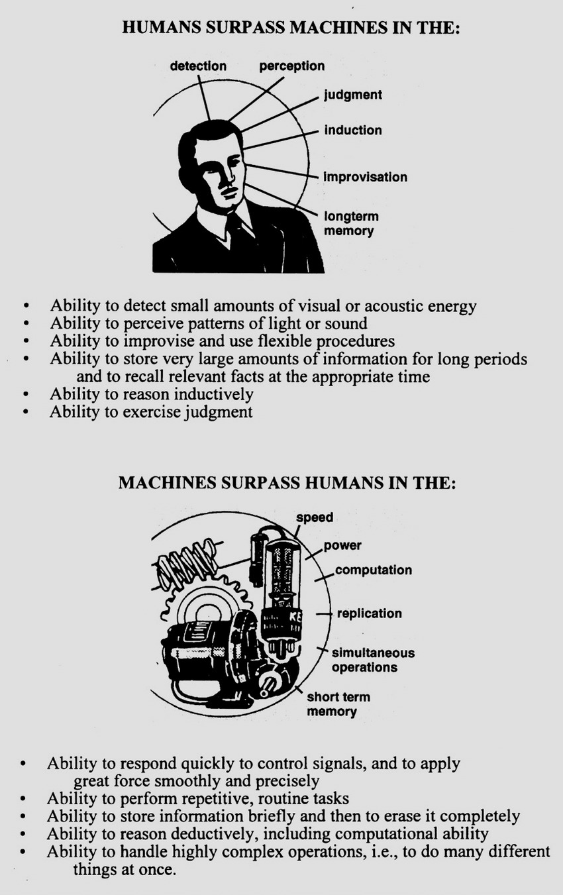

- from "Human engineering for an effective air navigation and traffic control system" (1951), a framework for deciding which tasks ought to be delegated to machines, and which ought to be done by humans. still influential!
	- aka "MABA-MABA"
	- {:height 786, :width 488}
	  id:: 668b3886-a09e-42cd-a691-b660e09f819e
- many folks in [[resilience engineering]] *reject* the Fitts List, including [[Erik Hollnagel]] and [[David D. Woods]], in favor of "human-machine cooperation"