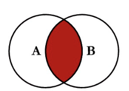
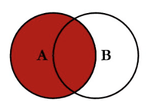
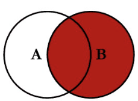

- types of joins:
	- an `INNER JOIN` selects records where both of two tables have a matching value.
		- 
	- a `LEFT JOIN` selects all records from the left table, plus any from the right table that have a matching value.
		- 
		- this means some of our records will have null values!
	- a `RIGHT JOIN` is the reverse of `LEFT JOIN` - it keeps all records from the right table, plus any matching values from the left.
		- 
	- a `FULL JOIN` combines a left and right join. it will return _all_ records, regardless of whether either table is missing the key.
	- a `CROSS JOIN` works really differently- it creates all possible combos of the two tables.
- when the field we wish to join on is the same across tables, we can use `USING` instead of `ON`:
	- ```SQL
	  SELECT b.title AS title, a.country AS country
	  FROM books AS b
	  INNER JOIN authors AS a
	  USING (author_id);
	  ```
- you can join a table with itself!