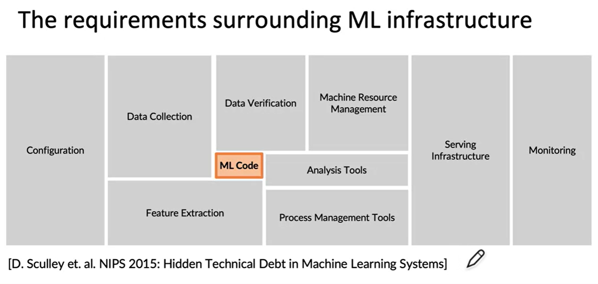

tags:: machine learning, devops

- the practice that sees machine learning through end-to-end, including deployment and monitoring. testing, versioning, [[continuous delivery]], and monitoring- these are all part of MLOps
- there are _lots_ of other parts to a machine learning system than just the ML code!
	- {:height 297, :width 627}