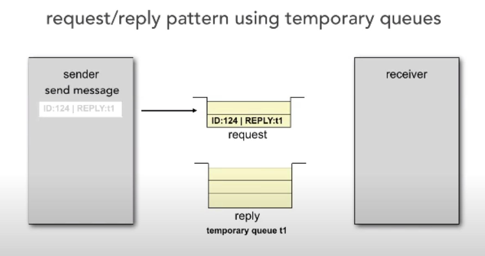

- [A treasure trove of bite-sized resources on architecture](https://www.developertoarchitect.com/lessons/)
	- I'm working through this 3-4 vids a week, to fill out my understanding of architecture!
- **Lesson 1 - Event-Driven Architecture: Request/Reply Processing** #event-driven #distsys
  collapsed:: true
	- [[request-reply pattern]] is very powerful- but it's asynchronous!
		- you can use a "correlation ID" to know which requests correspond with which replies
		- you can also use a _temporary_ queue, created from a key sent with the request:
			- 
- **Lesson 2 - How Kafka Differs From Standard Messaging** #event-driven #distsys
  collapsed:: true
	- [[Apache Kafka]] payloads are typically [[key-value pairs]] with atomic values, whereas "standard queues" like [[RabbitMQ]]/ [[Apache ActiveMQ]] are typically more structured
	- Kafka streams a continuous flow of data, others have distinct, bounded messages
	- Kafka can handle throughput up to 1M messages/sec in a tuned instance, 100K/sec on an average instance. standard queues tend to handle 4K-10K throughput
	- Kafka is especially good for *operational data*- about the health of the system. standard queues are good for transactional data
	- Kafka only supports a [[pub-sub model]], standard messaging can additionally do other paradigms like [[point-to-point]] messaging, or [[exchange]] topology
- **Lesson 3 - Soft Skills: Gaining Technical Breadth** #[[soft skills]]
  collapsed:: true
	- we're expected ti keep up with industry trends... but how?
	- think of a pyramid, topped with the stuff you know, the next level your [[known unknowns]] , and the base (and broadest!) level being [[unknown unknowns]]. *your goal is not primarily to expand the knowns- it's to move the unknown unknowns into known unknowns!*
		- you can think of your knowns as your *technical depth*, and your known unknowns as your *technical breadth*
		- as an architect, breadth becomes more important! you need some core of depth, but breadth makes the difference
	- Mark reads [InfoQ](https://www.infoq.com/), [ThoughtWorks Technology Radar](https://www.thoughtworks.com/radar), and [DZone](https://dzone.com/). 20 mins/day is enough to build the breadth. you only need to go deep on the stuff you actually decide to use!
		- don't click any of the stuff to limit it to one language or platform! you _want_ to see stuff you don't know about!
- **Lesson 4 - Microservices: Distributed Logging** #microservices #logging #distsys
  collapsed:: true
	- microservices makes the flow of an action complex to track- distributed across many logs in different services it flows through
	- even if you use tools like [[Splunk]] or [[Logstash]], that's not enough on its own!
	- two styles:
		- log consolidation: have services log out to something like Splunk, Logstash, etc. which will consolidate it together
		- log streaming: *stream* the logs to something like [[Apache Kafka]], then use a subscriber to consolidate
			- the power is that now you can do any ad-hoc analysis you want!
	- 4 steps you need to take to make either of these work:
		- **define request context ids.** without this, we can't know what the event flow was.
		- **define a context id heirarchy**. ideally a programmatic one! generally, there's a hierarchy of events- e.g. maybe `customer_id`s are more important than `order_id`s
		- **extract the context ids.** you can do that with framework code, interceptors, etc
		- **make context ids consistent.** if different services in the flow for an event care about different IDs, then you'll lose the data you need to trace a request through the services!
			- consider making an explicit, separate `context_id` and placing it at the top of the heirarchy
	- consider a custom logging API wrapper
		- this ensures users always pass the info that's needed for good tracing!
		- also enables using filtering logic- send some stuff out to Kafka, other stuff out to Logstash- all in one place, without affecting users, across the whole org and all its services
- **Lesson 5 - Microservices: Reducing Staging Iterations** #microservices #staging #distsys #planning
  collapsed:: true
	- a "staging iteration" is one that sets the stage for a future architecture change, but does not itself change the architecture
	- ex: current state -> setup continuous delivery -> setup container environment and deploys -> separate UI from business layer -> write and deploy infra services -> write and deploy first customer service
		- this is sound and safe, but it takes ages to get to the point where we're delivering any business value!
	- aside: devops gets hard as heck in a microservice environment! but at the same time, it gets much more important! you just can't manage a huge fleet of services manually.
	- how to reduce staging iterations? **don't treat non-dependent steps as iterations. treat them as parallel workstreams.**
		- the "set up the devops environment" stuff should be a parallel workflow!
		- we could separate the UI from the backend without needing the devops stuff set up
		- infrastructure services and first customer serviced could be done in parallel as well
			- in fact, can we really be effective at setting up the devops env _before_ we know what type of services will be in it? we'd just be building with test services, "hello world", etc
			- working in parallel gets us real live services to base the devop envs around and test it with
- **Lesson 6 - Classifying Architecture Patterns** #[[software architecture]]
  collapsed:: true
	- monoliths, service-based, microservice, piepline, space-based, layered, microkernel, event-driven... how do we classify all these architecture patterns we have?
	- one attempt: component-based vs service-based?
	- better: monolithic vs. distributed
		- in a distributed world, you need contracts, maintenance, versioning, coordination... you make changes and don't respect this, you break your app!
		- in a distributed world. time and latency become important
		- in a distributed world, security needs to be baked in. what might be "just a function" call in a Monolith, might need [[authn]] and [[authz]] in a microservice app!
		- in a distributed world, logging becomes more complex
		- in a distributed world, we need to think about transactionality
- **Lesson 7 - Analyzing Architecture: Structural Decay** #[[software architecture]]
  collapsed:: true
	- an architect needs to monitor and examine the application architecture for architecture vitality
	- part of this is looking for **structural decay**. by analogy to [[architecture]], think of a cracking bridge pylon
	- the thing we're analyzing isn't _really_ the source code- it's the structure holding up the code and infra. the patterns and "-ilities" ([[scalability]], [[reliability]], [[observability]]...), the architecture decisions and design principles...
- **Lesson 8 - Analyzing Architecture: Components** #[[software architecture]]
  collapsed:: true
	- components are the architect-defined building blocks of an application, which are in turn implemented in code by engineers (as classes, functions, services, etc.)
- **Lesson 9 - Analyzing Architecture: Macro Techniques**
  collapsed:: true
	- what we're doing when we do architecture is finding the cracks and seams in the foudnations of our applications.
	- in macro techniques, we don't look at the source code or low-level details.
	- three indicators of structural decay, that apply to any architecture:
		- static coupling
			- two types- **afferent coupling** (who depends on me?) and **efferent coupling** (who do I depend on?). afferent tends to be more important.
		- temporal coupling
			- there's no tool that can find all these timing dependencies!
		- component size
			- in Mark's experience, generally the larger a component is, the more coupled it is.
- **Lesson 10 - Analyzing Architecture: Microservices** #microservices
  collapsed:: true
	- this pattern is perhaps the most prone to structural decay! the more libraries we share, the more cracks in the pylon.
	- one common form of decay: too much inter-service communication. if a req comes in and requires 2 or more microservices to communication, you might have problems! consider moving back to a monolith...
	- another is too many orchestration requests. "get all" requests, etc. or aggregation requests, that use state to combine the data.
- **Lesson 11 - Analyzing Architecture: Code Metrics** #metrics
  collapsed:: true
	- one option is [[cyclomatic complexity]] - how many independent paths are there through the flow graph? calculated as $V(G) = edges - nodes + 2$
	- one limit with metrics- suppose you have a complexity of 3. is that good or bad? who knows! we need to know the trends over time, compare them to other similar areas of code, and incorporate expertise from the engineers that wrote it
	- 7 metrics Mark uses frequently:
		- number of classes per package
		- lines of source per package
		- average complexity (1 + num_paths_through_method) (borrowed from [[Code Complete]])
		- depth of inheritance tree (don't necessarily care about this _within_ a component, but do care _across_ components)
		- WMC (weighted sum of CC by method/class)
		- efferent coupling
		- afferent coupling
- **Lesson 12 - CQRS and Microservices** #CQRS #microservices
  collapsed:: true
	- CQRS is all about separating **commands** from **queries**
	- our first problem is with the model— reads and writes have different concerns.
	- our second problem is with performance— things that optimize reads, like adding indices, will slow down writes.
	- so, first let's make a separate model for entity-driven commands, and aggregate-driven queries
	- second, let's split the DB into a read and write DB
	- that's not so dissimilar form microservices! we could choose to split up our services in this same way. that might be especially useful for scalability if we have something that, say, gets read way more often than written.
	- how to handle the data, though? we could use a cache. only the write service is connected to the DB, but it shares a cache with the query service.
- **Lesson 13 - Microservices and Reporting** #microservices
  collapsed:: true
	- a database pull model for constructing reports doesn't work well in a microservice environment! it breaks encapsulation. any schema change will break the reporting!
	- instead, you could try an http pull model. ask each microservice itself for the data
		- but this will likely have performance issues and data volume problems over REST
	- instead, try an event-based push model. create a dedicated reporting database. have each microservice push it to an event bus, then a data capture service will slurp it all into the reporting db. now you can do your reports from just that one DB
		- this might cause latency, but that's usually fine
		- you can also do filtering and transformation in the capture service
- **Lesson 14 - Refactoring Patterns: Migration vs. Adaptation** #migration
  collapsed:: true
	- migration: in this pattern, we replace old components with new ones through a migration over time. when we're done, we can delete the old thing
		- easier to roll back
		- less overall risk
		- requires a period of parallel maintenance
		- requires switching logic in calling components
	- adaptation: in this pattern, we rewrite the existing component over time to adopt the new functionality in-place. more of a [[refactoring]] than a replacement!
		- harder to roll back
	- no changes to calling components. they don't even need to know the refactor is happening.
- **Lesson 15 - Refactoring: Business Justification** #[[business case]]
  collapsed:: true
	- how do we convince folks that an architectural refactor is actually valuable? we have to put a business reason to it.
	- terms like robustness, decoupled, application unit, JVM resources... these are part of a solid _technical_ justification, but they won't make it clear why the business should pay money for it!
	- for example: "robustness will be increased and deployment errors will drop" -> "there will be fewer bugs so user satisfaction will go up", or "deployment time will be accelerated" -> "we can deliver new functionality faster, improving our time to market"
	- generally, we'll want to reach for one of three metrics:
		- reduced overall cost
		- better time-to-market
		- better user satisfaction
	- but we can't just pay lip service. we need to be able to *measure* these benefits. so:
		- cost: estimate with actual # of bugs, or actual hours spent on dev and testing. classify the types of bugs you have an estimate how many of them your project might remove.
		- time to market: estimate with E2E calendar time, or hours spent on dev and test.
		- user satisfaction: estimate with # of errors measured, # of user-reported bugs, performance metrics
			- don't use a survey! they tend to invite general complaint that doesn't tell you much about the specific technical problem folks want answers for
- **Lesson 16 - The Challenges of Architecture Teams**
	- an anti-pattern to be aware of is the Witch's Brew. if your architecture has no coherent vision and direction, you might just mix random stuff together with no cohesion. it'll be super complex and won't work.
	- architects can tend to be egotistical and fall prey to the [[Golden Hammer]], thinking they know exactly what to do & there's one right way to do things
	- consider selecting a mediator in your architecture team. they're not the head honcho, they're here to resolve conflict. they look at the overall vision and direction, and when conflict arises, use it to make a decision for this individual case.
	- don't choose this role by rank or seniority. pick it randomly if you have to. consider rotating it regularly.
	- then, require every architectural decision a team member wants to make comes with a reasonable justification
	- this only works if we all agree up-front that when conflicts occur, we all have to go with the mediator.