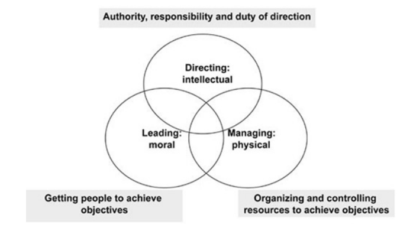
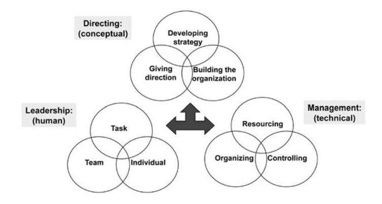

tags:: The Art of Action, management, strategy, management OS

- from [[The Art of Action]], a taxonomy of the skills managers need. in the past, we lumped everything under "managing" lately, we lump everything under "leadership". in reality, there are three spheres:
- **directing:** authority, responsibility, and duty of direction
	- intellectual, conceptual
	- success looks like:
		- "READY: I understand what I have to do and why"
	- > The duties and responsibilities of command involve setting direction. The skills required are primarily intellectual. Commanders develop strategic direction considering the aims they have been given, the environment they are in, and the capabilities of their organization. They also further build the capabilities the organization needs to realize the strategy. They then have to actually give direction by communicating their intent in ways on which the organization can act.
- **leading:** getting people to achieve objectives
	- moral, human, personal
	- success looks like:
		- "WILLING: I am prepared to go along with this / I am committed to making this a success"
	- > Leading is a human activity that is moral and emotional. The work of a leader is to motivate and if possible inspire followers so that they are willing to go in the required direction and perform their own tasks better than they would have done had the leader not been there. Leaders have to balance their attention between defining and achieving the specific task of their group, building and maintaining the team as a team, and meeting the needs of and developing the individuals within it.
- **managing:** organizing and controlling resources to achieve objectives
	- physical, technical, measuring
	- success looks like:
		- "ABLE: I have the skills and resources to make a start / carry it through"
	- > Management is about providing and controlling the means of following the direction. It requires brainwork, but is less conceptual than the work of command, and more a matter of physical direction: marshalling resources, organizing and controlling them. Managing means understanding objectives, solving problems so that they can be achieved, and creating processes so that the work of others can be organized efficiently. Good management means making the maximum use of resources, including money and people.
- these three spheres overlap, and they each involve subskills that themselves overlap!
	- {:height 203, :width 308}
	- {:height 184, :width 307}
- these are not different people, but different skills. you should hone them all, and use the right ones at the right time.