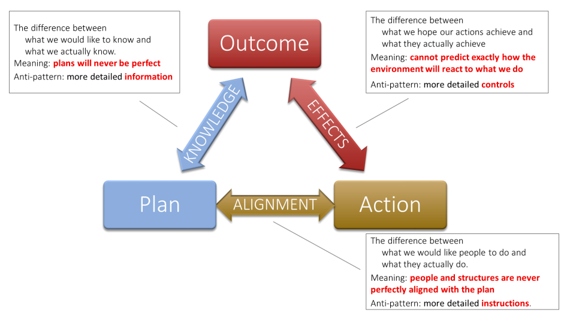

- *taken from [[The Art of Action]]: an explanation of why we are often so bad about strategy, and what we can do about it.*
- we are flawed humans, acting in a world we have limited information about, and full of other agents taking competing actions. this leads to constant **friction** between our plans and reality. this friction manifests itself in the form of **Three Gaps**:
	- **the knowledge gap:** the gap between what we planned, and how it turned out.
		- > The gap between plans and outcomes concerns knowledge: It is the difference between what we would like to know and what we actually know. It means that we cannot create perfect plans.
		- we are tempted to solve this by gathering more information. **avoid this!** it's a doomed effort, as we can *never* have perfect information.
		- instead: **limit your directions to defining and expressing the essential intent**. plan only what can be planned, and accept the unavoidable uncertainty of business.
	- **the alignment gap:** the gap between what we planned, and what we actually did
		- > The gap between plans and actions concerns alignment: It is the difference between what we would like people to do and what they actually do. It means that even if we encourage them to switch off their brains, we cannot know enough about them to program them perfectly.
		- we are tempted to solve this by providing more detailed instructions, and micromanaging. **avoid this!** it is a doomed effort, as people are unpredictable.
		- instead: **cascade strategy down through the business.** allow each level of the business to autonomously define what it will do to realize the business's intent, adding to the one above, but all united in the intention.
	- **the effects gap:** the gap between what we did, and how it turned out.
		- > The gap between actions and outcomes concerns effects: It is the difference between what we hope our actions will achieve and what they actually achieve. We can never fully predict how the environment will react to what we do. It means that we cannot know in advance exactly what outcomes the actions of our organization are going to create.
		- we are tempted to solve this by providing more detailed controls, and piling on metrics and scorecards. **avoid this!** it is a doomed effort, as a metric can only tell you how you're doing, but not what to do or why!
		- instead: **cultivate [[independent thinking obedience]]**. make the use of individual initiative central! give individuals the freedom to adjust their actions in line with the intent. **use lightweight metrics to see if it's working, and don't be afraid to change them.**
	- {:height 328, :width 549}
- in short, we resolve the Three Gaps by resisting our natural temptation toward unhelpful reactions, and instead embracing the uncertainty. by adopting an ethos of [[directed opportunism]], we build an organization that is trained to work well with uncertainty- acting with both [[autonomy]] and alignment, adjusting plans fluidly in the field as needed, and exploiting unexpected opportunities as they come.