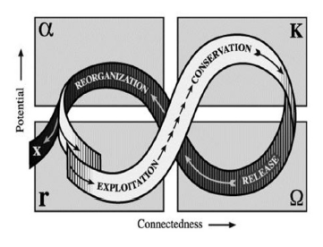

- a model of system change developed by [[C.S. Holling]] in the context of ecology, but applicable elsewhere.
- the model includes 4 phases that repeat in a loop:
	- **exploitation:** expansion, growth, increasing complexity. successfully reoriented post-crisis. plenty of resources to go around. dominated by self-organizing processes of assembly. network connections are established. interdependencies are built. positive [[feedback loops]] cause [[emergent]] patterns to scale up and dominate.
	- **conservation:** the system settles into a steady configuration. [[equilibrium]] and stability dominate. the system has reached a high level of development and interconnection. negative feedback cycles dominate over positive feedback. rigidity may start to form. some nodes may start to dominate others. the system may begin depending upon its prevailing conditions and lose adaptibility. stagnation may begin to set in
	- **release:** crisis and [[collapse]]. an external crisis hits the system. positive feedback push the system out of its stability domain and it falls apart. resilience in the face of crises becomes the most important property to cultivate.
	- **reorganization:** the system begins to recover from falling apart. change and reorientation. there may be many different paths the system could take- might reestablish old patterns, might create totally new ones. chance may play a role. sets the stage for future growth. new elements may enter.
	- 
- we can't change this cycle! it's inherent to the way systems work. what we need to do is adapt to the stage we're in, and make the right choices to keep the system healthy in its current circumstances.