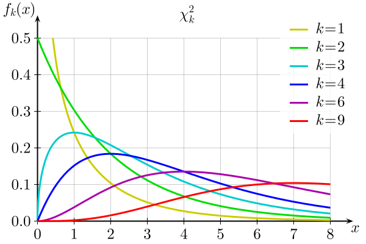

tags:: stats

- a distribution family which originates at 0, is positively-skewed, and goes off to infinity. but it approaches [[normality]] as its degrees of freedom increase
	- it is the sum of the squares of `k` independent normal random variables
	- {:height 280, :width 409}