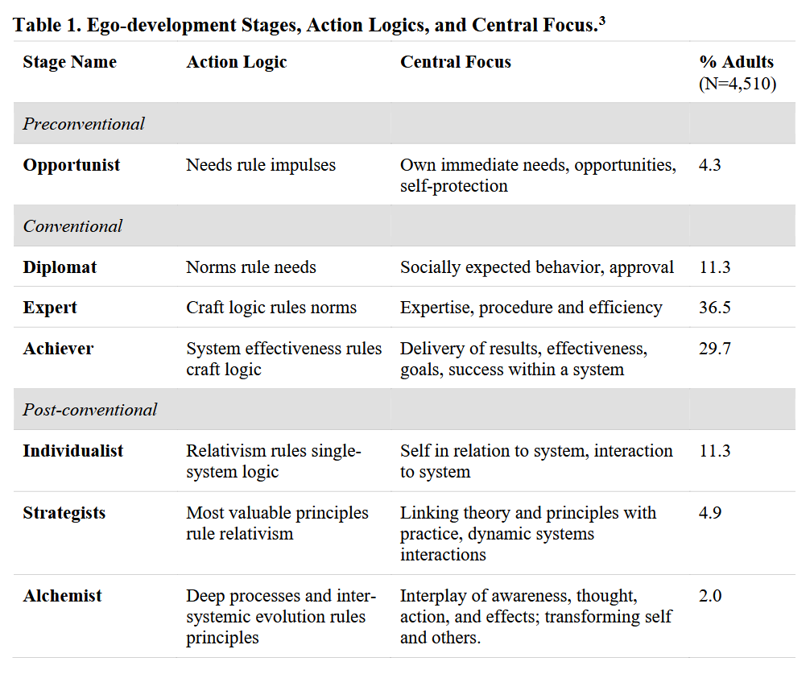

- developed by [[Susanne Cook-Greuter]], a stage-based model of the path of human development, from infancy to adulthood, prerationality to metarationality, and preverbal ignorance to wisdom
- there's a progress from pre-conventional (survivor), to conventional (socialized, specialist, independent), to post-conventional (relative, integrative, construct). about 66% of folks are in the conventional stages
- some of the stages in detail:
	- 