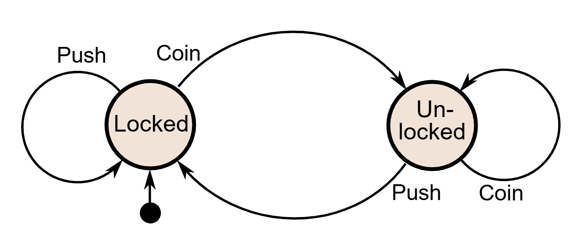

- a construct that defines **states** and **transitions** between those states. something like this:
	- {:height 283, :width 648}
- in its most simple implementation, it might just be a global variable for the state, and a `while` loop that does different stuff based on the value of that state
- we might organize more complex logic as a **heirarchical finite state machine**, where each state may have a number of sub-states