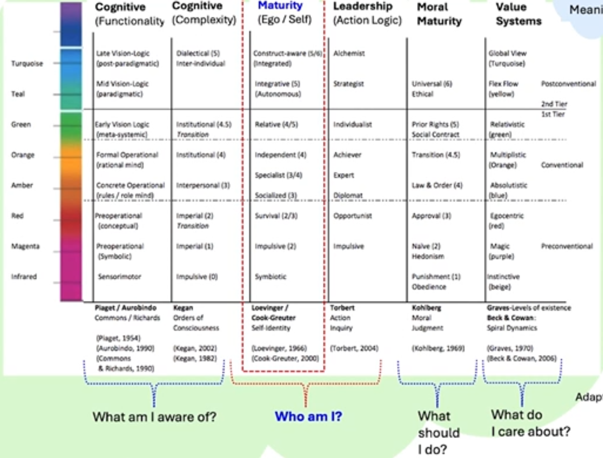

- there are many different models of stages of development, focusing on different axes. some have similarities!
	- 
		- Piaget's genetic epistemology (focused on sensing), Kohlberg's moral reasoning (separated into pre-conventional, conventional, post-conventional), Perry's epistemological growth (focused on knowledge and belief)...