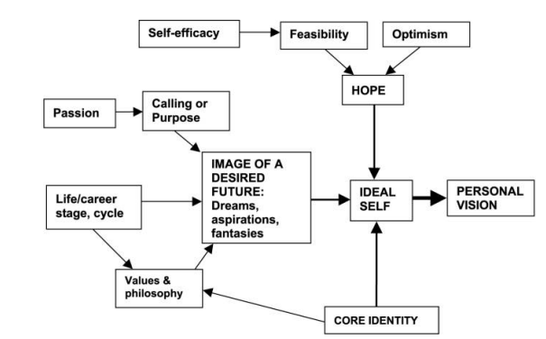

- refs:
	- [Boyatzis, R.E.](https://www.emerald.com/insight/search?q=Richard%20E.%20Boyatzis) and [Akrivou, K.](https://www.emerald.com/insight/search?q=Kleio%20Akrivou) (2006), "[The ideal self as the driver of intentional change](https://www.researchgate.net/publication/242203714_The_ideal_self_as_the_driver_of_intentional_change)", *[Journal of Management Development](https://www.emerald.com/insight/publication/issn/0262-1711)*, Vol. 25 No. 7, pp. 624-642.
- the ideal [[self]] is partially conscious and partially unsconscious, and both privately conceptualized and socially influenced.
- in a [[psychoanalytic]] therapeutic model, it's seen as a defensive mechanism, something to be overcome
- but in a [[positive psychology]] model, it's a good thing- a mechanism of [[self-regulation]] and intrinsic motivation. it helps to organize the will to change, and direct it.
	- 
	- a large component of the ideal self is [[hope]]
	- processes leading to a healthy ideal self:
		- **Is the ideal self articulated, explicit?* if not:
			- > The person experiences catastrophic jumps, surprises, or emergence. The person is mindless or in denial of a desired future
		- **Is the ideal self important?** if not:
			- > Like New Year’s Eve resolutions, the person makes superficial commitments to change
		- **Is it integrated with the rest?** if not:
			- > The person experiences surprises and unintended consequences in other parts of their life even when making progress or changes in other parts of their life or work
- from a [[narrative self]] perspective, the ideal self can be seen as the "final cause" of one's life- the [[teleological]] endpoint that drives one's actions
- in literature:
	- > They do not know that the dream is a constant in life. [...] They do not know that the dream is wine, it’s fizz, it’s yeast. It’s an eager and vivacious small animal with a pointy nose that pries through everything in a perpetual motion. They do not know that the dream is canvas and color and brush. They do not know nor even dream that dream commands life. When a man or a woman dreams, the world leaps and moves forward like a colorful ball in the hands of a child
	  > "*Pedra filosofal*", António Gedeão
	  #poetry
- at the organizational level, this ties into the [[vision statement]] - a sort of ideal self for the company