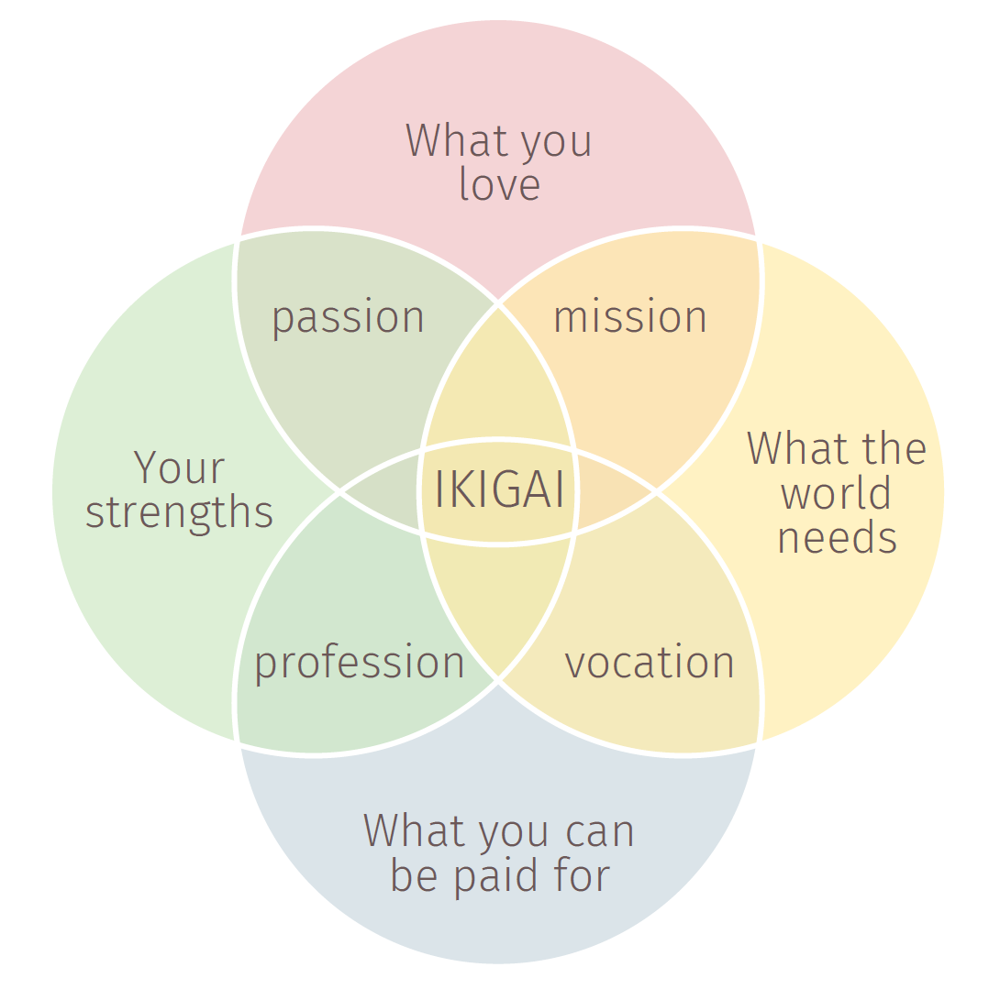

- *ikigai* is a state of wellbeing that arises from devotion to activities one enjoys, which also brings a sense of fulfillment (Kumano 2017)
- different from momentary pleasure- more like the classical Greek [[eudaimonia]]
- a Westernized take on ikigai might look like:
	- {:height 500, :width 494}