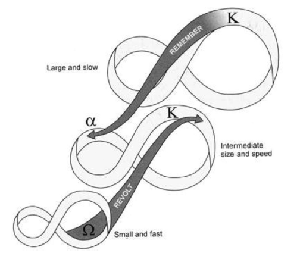

- a [[system of systems]] of nested [[adaptive cycle]]s, each with bi-directional feedback across levels of scale
	- 
	- due to [[C.S. Holling]] from an ecology context originally
- often, orders of magnitude are what separate the systems
	- example: the biological processes of pine needle growth on a pine tree -> the geological and ecosystem processes that determine the boundaries of a boreal forest -> the climate dynamics that drive weather on planet Earth
- process discontinuities may also drive separation:
	- photosynthesis driving leaf growth -> herbivory driving vegetation patch dynamics -> climate change driving animal migration
- within a domain of scale, particular processes or structures tend not to change or to change monotonically. outside that domain, they may be wildly different.
- failures at a lower scale can cascade up to failures at a larger scale