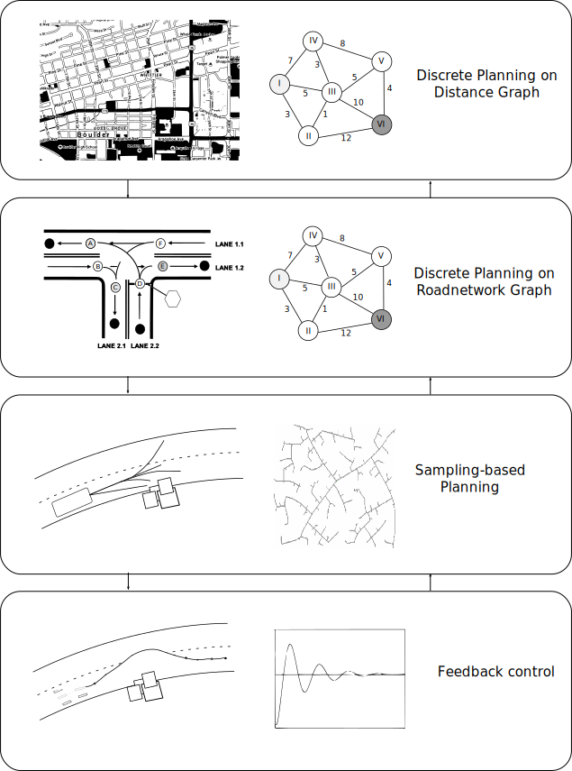

- feedback-based control (like [[proportional control]] or [[PID control]]) isn't enough for broad goals like "navigate a city" or "drive down this road"! we need techniques to handle a higher-level goal of choosing a sequence of good waypoints.
- this might play out differently at various levels of scale:
	- {:height 645, :width 457}
- a lot of path planning is about [[graph]]s
	- one graph property we might like to have is *short length*. we often want to find the shortest path from A to B. a few algorithms we can use:
		- [[breadth-first search]]
		- [[Dijkstra's algorithm]]
		- [[A*]]
		-