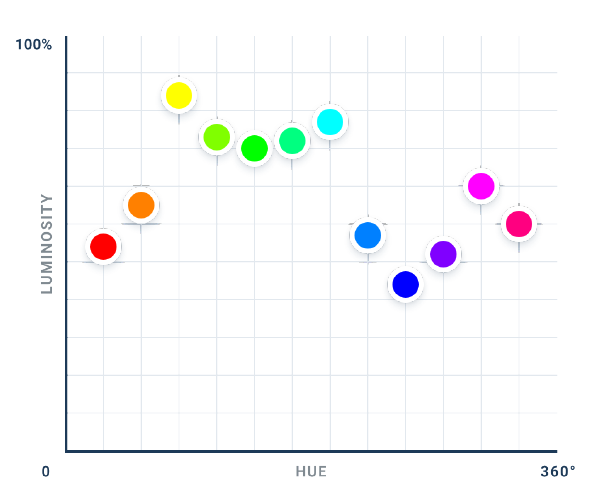

- the human eye doesn't see lightness in the same way that, say, the [[HSL]] space does. we see some hues as inherently brighter than others.
	- it's also nonlinear. we don't see a smooth ramp of lightest to darkest hues. there appear to be three separate clusters, with their own local minima and maxima
	- 