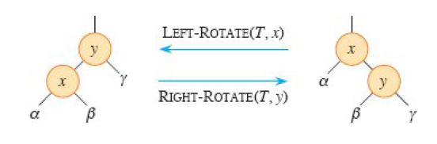

- a red-black tree is a [[binary search tree]] with one extra bit per node: it's **color**, which can be either red or black. it uses rules about these colors to ensure that no path to a leaf is more than twice as long as any other. which is to say, that it's approximately balanced, and has height $O(\log n)$
	- every node is either red or black
	- the root is black
	- each leaf (`nil`) is black
	- if a node is red, both children are black
	- for each node, all simple paths from the node to leaves below contains the same number of black nodes
- the **black-height** of a node is the number of black nodes on a path from a node $n$ down to a leaf (not including $n$ itself)
- search, minimum, maximum, successor, and predecessor can all run in $O(\log n)$ time
- insertion and deletion are more complex, since we need to preserve the red-black properties! we can do them in $O(\log n)$:
	- we can use **rotation**, which preserves those properties.
		- 
	- to insert a node, first insert $n$ as though it were a normal binary search tree, and color it red. then, we have to restore the red-black properties. the only two violations that can happen are that the root is black (if this is the only node in the tree), and that a red node cannot have a red child. in that second case, there are three options:
		- if $n$'s uncle is red, you can make the grandparent red, and the parent and uncle black. (then recur, because you might have a new violation at the grandparent.)
		- if $n$'s uncle is black and $n$ is a right child, do a left rotation, then go to the next case (which will now be true)
		- if $n$'s uncle is black and $n$ is a left child, do a right rotation, then make $n$ black and its two children red
- deletion is also more complex. we can still do a deletion procedure like we would with a regular BST, but then we need to once again restore the red-black properties.
	- if the node we remove was red, we're golden.
	- if the node was black, we could have three problems.
		- property 2 is violated if we deleted the root
		- property 4 is violated if both $n$'s parent and the node that replaced $n$ are red
		- property 5 is violated because $n$'s replacement causes every path that ran through it to have one fewer black node