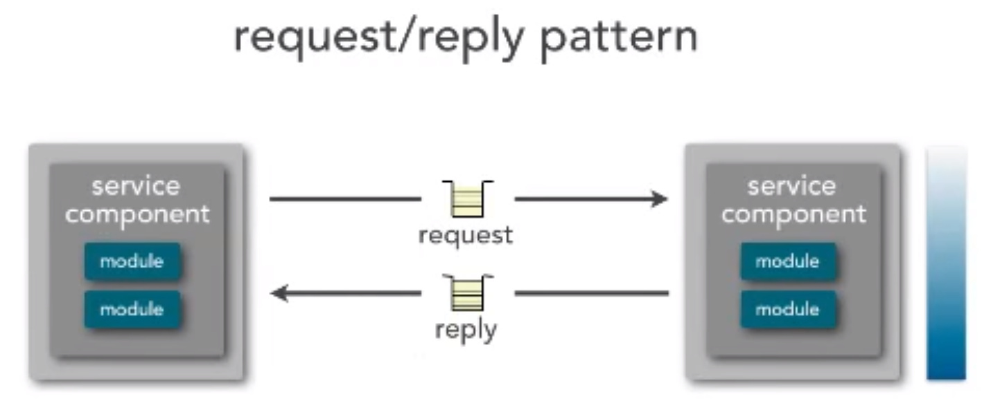

tags:: software architecture, software engineering, event-driven

- via Software Architecture Monday:
	- 
- involves _two_ [[message queue]]s - a request queue, and a reply queue. you send a request with an ID, then you go to something else, then eventually you receive a reply with that ID
-